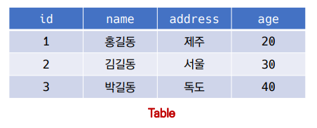

### 💻Database

- 데이터베이스는 `체계화된 데이터의 모임`이다.

- 여러 사람이 `공유/사용할 목적으로 통합 관리되는 정보의 집합`이다.

- 논리적으로 연관된 자료의 모음으로 그 내용을 고도로 구조함으로써 `검색과 갱신의 효율화`를 꾀한 것이다.

- 즉 데이터베이스는, `자료 파일들을 조직적으로 통합`하여 `자료 항목의 중복을 없애고`, `자료를 구조화하여 기억`시켜 놓은 `자료의 집합체`라고 볼 수 있다.

### 💻그래서 데이터 베이스를 왜 사용하는데?

데이터 베이스 사용에는 아래와 같은 장점들이 존재한다.

- `데이터 중복 최소화`: 정규화와 같은 데이터의 통합을 통해 중복을 방지할 수 있다.

- `데이터 무결성(진실성, Integrity)`: 데이터의 정확성, 일관성, 유효성이 유지되는 것을 뜻한다. 무결성의 종류에는 개체 무결성, 참조 무결성, 도메인 무결성 등이 있다. 정보처리기사에서도 지겹도록 다뤘고 추후에 배울 내용이니 간단히 숙지하자.

- `데이터 일관성(정합성, Consistency)`: 동일한 데이터가 저장소 내에 흩어져 있는 경우에, 시간이 지남에 따라 동일한 데이터가 서로 다른 값을 가질 가능성이 높아지는데, 데이터 베이스에서는 이를 막고 데이터가 일관된 값을 가질 수 있도록 한다. 즉, 변하지 않는 데이터 값을 지니는 것을 데이터 일관성, 또는 정합성이라고 한다.

- `데이터 독립성(물리적/논리적)`: 논리적 독립성은 응용 프로그램에 영향을 주지 않고 데이터베이스의 논리적 구조를 변경할 수 있는 능력이다. 물리적 독립성은 응용 프로그램이나 논리적 구조에 영향을 주지 않고 데이터의 물리적 구조를 변경할 수 있는 능력이다.

- `데이터 표준화`: 데이터의 명칭, 정의, 형식, 규칙을 일관되게 유지할 수 있도록 한다.

- `데이터 보안 유지`: 데이터의 보안성을 유지할 수 있다.

### 💻RDB(Relational Dababase)

관계형 데이터베이스, RDB란?:

`서로 관련된 데이터를 저장하고 접근`할 수 있는 데이터베이스 유형

키와 값들의 간단한 관계를 `표(table) 형태로 정리한 데이터 베이스`

🍯RDB에서 주로 사용되는 용어들을 간단히 짚고 넘어가보자.

- `스키마(schema)`: 데이터베이스에서 자료의 구조, 표현방법, 관계 등 전반적인 명세를 기술한 것이다.
  `age = int, name = text`와 같이 데이터의 형태, 관계와 같은 전반적인 명세를 기술한다.
  이러한 틀을 만들어 놓는 것을 스키마라고 한다. `지식을 표상하는 구조`, 즉 스키마는 `데이터베이스의 구조를 정의하는 용어`라고 생각하면 된다.

  ```SQL
  -- 아래와 같이 테이블의 데이터베이스의 구조를 확인할 수 있다.
  sqlite3> .schema healthcare

  CREATE TABLE healthcare (
  id PRIMARY KEY,
  sido INTEGER NOT NULL,
  gender INTEGER NOT NULL,
  age INTEGER NOT NULL,
  height INTEGER NOT NULL,
  weight INTEGER NOT NULL,
  waist REAL NOT NULL,
  va_left REAL NOT NULL,
  va_right REAL NOT NULL,
  blood_pressure INTEGER NOT NULL,
  smoking INTEGER NOT NULL,
  is_drinking BOOLEAN NOT NULL
  );
  ```

- `테이블(table)`: 스키마를 바탕으로 만들어지는 것이 바로 테이블이다. 열(컬럼/필드)과 행(레코드/값)의 모델을 사용해 조직된 데이터 요소들의 집합이다.

  

가로줄: 행, row, record

세로줄: 열, column, field

행: 실제 데이터가 저장되는 형태

`기본키(Primary Key)`: 각 행(레코드)의 고유 값이다.

기본키는 반드시 설정해야 하며, 데이터베이스 관리 및 관계 설정 시 주요하게 활용 된다.

각 튜플에 할당되는 `고유한 값`이어야 한다. 절대로 중복이 발생하지 않는 고유한 값이다.

예를 들어 대한민국 국민은 주민번호, 군인은 군번, 학생은 학번이 각각의 기본키가 된다고 할 수 있겠다.

### 💻RDBMS(Relational Database Management System)

관계형 모델을 기반으로 하는 데이터 관리 시스템을 RDBMS라고 한다. 본 수업에서는 SQLite(시-퀄라이트)를 사용하였다!

🍯SQLite의 특징에 대해 알아보자!

서버 형태가 아닌 파일 형식으로 응용 프로그램에 넣어서 사용하는 비교적 가벼운 데이터베이스

구글 안드로이드 운영체제에 기본적으로 탑재된 데이터베이스이며, 임베디드 소프트웨어에도 많이 활용된다.

로컬에서 간단한 DB 구성을 할 수 있으며, 오픈소스 프로젝트이기 때문에 자유롭게 사용가능하다.

### 💻SQL(Structured Query Language)

- 관계형 데이터베이스 관리시스템의 데이터 관리를 위해 설계된 특수 목적으로 프로그래밍 언어

- 데이터베이스 스키마 생성 및 수정

- 자료의 검색 및 관리

- 데이터베이스 객체 접근 조정 관리

🍯SQL의 언어는 크게 DDL, DML, DCL 세 가지로 나뉜다.

`DDL(Data Definition Language)`: 데이터 정의 언어

관계형 데이터베이스 구조(테이블, 스키마)를 정의하기 위한 명령어 (CREATE, DROP, ALTER)

`DML(Data Manipulation Language)`: 데이터 조작 언어

데이터를 저장, 조회, 수정, 삭제 등을 하기 위한 명령어 (INSERT, SELECT, UPDATE, DELETE)

`DCL(Data Control Language)`: 데이터 제어 언어

데이터베이스 사용자의 권한 제어를 위해 사용하는 명령어 (GRANT, REVOKE, COMMIT, ROLLBACK)

### 💻테이블을 생성하고 조작해보자.

⛔QUERY문 작성시 반드시 세미콜론을 마지막에 붙여줘야한다.

```SQL
-- 테이블 생성
CREATE TABLE classmates(
    id INTEGER PRIMARY KEY,
    NAME TEXT
);

.tables -- 테이블의 목록 조회가 가능하다.

.schema classmates -- 특정 테이블의 스키마 조회가 가능하다.

INSERT INTO classmates VALUES (1, '홍길동'); -- 값 추가가 가능하다.

SELECT * FROM classmates; -- 테이블의 데이터를 조회가 가능하다.

INSERT INTO classmates VALUES (2, '이동희'); -- 다시 값 추가가 가능하다.

DROP TABLE classmates; -- 테이블 삭제
```

### 💻테이블 생성시의 필드 제약 조건

- NOT NULL: NULL 값 입력 금지

- UNIQUE: 중복 값 입력 금지(NULL 값은 중복 입력 가능)

- PRIMARY KEY: 해당 필드를 기본키로 설정. 기본키는 테이블에서 반드시 하나여야한다. NOT NULL + UNIQUE의 성질을 가진다.

- FOREIGN KEY: 외래키. 다른 테이블의 Key를 뜻한다.

- CHECK: 조건으로 설정된 값만 입력 허용

- DEFAULT: 기본 설정 값

```SQL
-- students 테이블을 생성해보자.
CREATE TABLE students(
    id INTEGER PRIMARY KEY, -- id를 기본키로 설정한다. (유일해야 하며, 비어서는 안된다.)
    name TEXT NOT NULL, -- name 또한 NOT NULL로 설정 (비어서는 안된다.)
    age INTEGER DEFAULT 1 CHECK (0 < age) -- age는 양수여야만 하며, 비어있을 경우 기본값인 1로 설정된다.
);
```

### 💻CRUD: CREATE, READ, UPDATE, DELETE

### 💻CREATE

- INSERT

"insert a single row into a table" / 테이블에 하나의 레코드를 생성하여 집어넣는다.

`INSERT INTO table_name (col1, col2) VALUES (val1, val2);`

classmates 테이블에 이름이 홍길동이고 나이가 23인 데이터를 넣어보자. 그리고 SELECT문으로 결과를 확인해보자.

```SQL
-- INSERT INTO 테이블이름 (필드1, 필드2 ...) VALUES (값1, 값2 ...)
INSERT INTO classmates (name, age) VALUES ('홍길동', 23);

SELECT * FROM classmates;
```

🍯여러 레코드를 테이블에 한꺼번에 추가하고 싶을 때는 아래와 같이 쿼리문을 작성하면 된다.

홍길동/30/서울

김철수/30/제주

이호영/26/인천

박민희/29/대구

최혜영/28/전주

를 한꺼번에 추가해보자.

```SQL
INSERT INTO people VALUES
('홍길동', 30, '서울'),
('김철수', 30, '제주'),
('이호영', 26, '인천'),
('박민희', 29, '대구'),
('최혜영', 28, '전주');
```

### 💻READ

- SELECT

"query data from a table" / 테이블에서 원하는 row, 레코드를 출력한다. 테이블에서 데이터를 조회할 때 사용된다.

가장 기본이 되는 문이며 다양한 절(clause)와 함께 사용된다.

Ex: ORDER BY, DISTINCT, WHERE, LIMIT, GROUP BY ... 등

- LIMIT

"constrain the number of rows returned by a query" / 쿼리를 통해 반환되는 행의 수를 제한한다.

특정 행부터 시작해서 조회하기 위해 `OFFSET`과 함께 사용되기도 한다.

> 컴퓨터 과학에서 배열이나 자료 구조 오브젝트 내의 오프셋(offset)은 일반적으로 동일 오브젝트 안에서 오브젝트 처음부터 주어진 요소나 지점까지의 변위차를 나타내는 정수형이다. 이를테면, 문자 A의 배열이 abcdef를 포함한다면 'c' 문자는 A 시작점에서 2의 오프셋을 지닌다고 할 수 있다.어셈블리어와 같은 저급 프로그래밍 언어에서 오프셋은 상대 주소(relative address)로 부른다.

```SQL
--3번째에서 7번째까지의 행만 출력한다. (3,4,5,6,7)
SELECT *
FROM users
LIMIT 5 OFFSET 2; -- LIMIT: 5개의 행만 출력, OFFSET: 2+1번째 행부터 출력
```

- WHERE

"specify the search condition for rows returned by query" / 쿼리에서 반환된 행에 대한 특정 검색 조건을 지정한다.

classmates 테이블에서 id,name 컬럼 값을 하나만 조회

```SQL
SELECT rowid, name
FROM classmates
LIMIT 1;
```

2부터 시작(OFFSET 2)해서 하나 더 큰 값 하나만 조회(LIMIT 1)

```sql
SELECT rowid, name
FROM classmates
LIMIT 1 OFFSET 2;
```

조건에 해당되는 레코드만 출력

```sql
SELECT *
FROM classmates
WHERE address = '서울';
```

classmates 테이블 에서 age 를 중복없이 조회

```sql
SELECT DISTINCT age
FROM classmates;
```

- SELECT DISTINCT

"remove duplicate rows in the result set" / 조회 결과에서 중복된 행은 제거한다.

⛔DISTINCT절은 SELECT 뒤에 작성해야 한다.

### 💻DELETE

- DELETE

"remove rows from a table" / 테이블에서 행을 제거한다.

조건에 해당하는 레코드만 삭제

```sql
'''
DELETE
FROM 테이블이름
WHERE 조건;
'''

DELETE
FROM classmates
where rowid = 5;
```

테이블 자체를 삭제 (⛔항상 주의해서 사용하도록 하자)

```sql
DROP TABLE classmates;
```

AUTO INCREMENT란:

테이블을 관리하다 보면 값을 수정,삭제하게 되는데,

SQLite는 이러한 삭제된 행의 값이 재사용되는 것을 방지하기 위해 AUTOINCREMENT 기능을 제공한다.

AUTOINCREMENT를 통해 기존 값이 삭제되면 이어서 쓰는 것이 아니라 띄우고 이어진다.

```SQL
CREATE TABLE members(
    id INTEGER PRIMARY KEY AUTOINCREMENT, -- id를 autoincrement로 지정해준다.
    name TEXT NOT NULL,
)

INSERT INTO members VALUES
(1, '홍길동'),
(2, '김철수'),
(3, '이호영'),
(4, '박민희'),
(5, '최혜영');

DELETE FROM members where rowid = 5; -- 5번 행을 삭제함으로써 중간이 공백이 발생한다.
INSERT INTO members (name) VALUES ('고길동'); -- 행을 추가해준다.
SELECT * FROM members -- 새로운 행을 추가해도 5번으로 생성되는 것이 아니라 6번으로 생성됨을 확인 가능하다.

'''
결과:
id name
-- ----
1  홍길동
2  김철수
3  이호영
4  박민희
6  고길동
'''
```

### 💻UPDATE

"update data of existing rows in the table" / 기존 행의 데이터를 수정

SET clause를 통해 테이블의 각 열에 대해 새로운 값을 설정할 수 있다.

```SQL
'''
UPDATE 테이블이름
SET 필드값 = '새로운 값'
WHERE 조건
'''
UPDATE classmates
SET address = '서울'
WHERE rowid = 5;

SELECT * FROM classmates;
```
