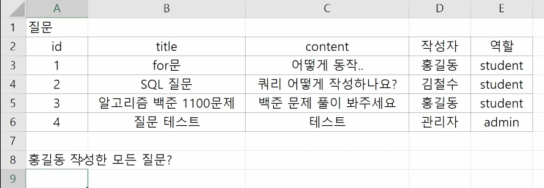
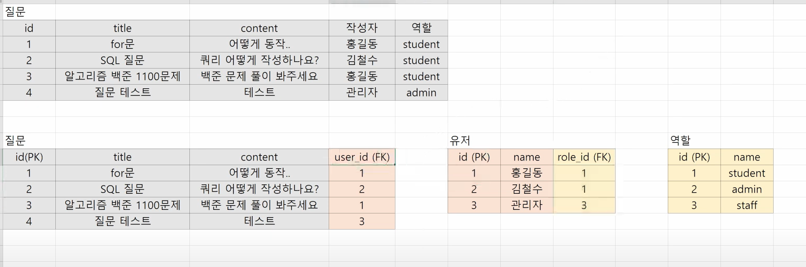
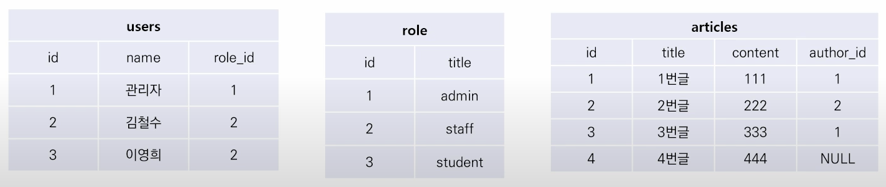

### 💻JOIN

관계형 데이터베이스의 `가장 큰 장점`이자 `핵심적인 기능`

DB에서는 일반적으로 `하나의 테이블에 여러 데이터를 넣는 것이 아니라 여러 테이블에 다양한 데이터를 넣어 테이블을 나눠서 저장`하게 되며, 여러 테이블을 `결합(Join)하여 출력 및 활용`한다.

일반적으로는 레코드는 `기본키(PK)나 외래키(FK) 값`의 관계에 의해 결합한다.

아래와 같이 테이블이 존재한다고 할 때, 홍길동이 작성한 모든 질문을 조회할 수 있는 쿼리를 작성해보자.



```sql
SELECT *
FROM 질문
WHERE 작성자 = '홍길동';
```

만약에 작성자가 동명이인이면 어떻게 해야할까? 이 홍길동이 어떤 홍길동인지 어떻게 판별할 수 있을까?

만약에 홍길동의 이름이 바뀐다면 테이블의 모든 행의 홍길동 이름을 일일이 변경해줘야 하는데 이를 한번에 편하게 바꿀 수는 없을까?



위와 같이 테이블을 분리하여 관리할 경우, 레코드를 일일히 수정할 필요가 없이 해당 테이블의 레코드만 수정해주면 된다. 관리가 편해진다!

예를 들어 작성자를 변경하고 싶을 경우, 유저 테이블의 name 필드만 변경해주면 된다.

```sql
UPDATE 유저
SET name = '고길동'
WHERE name = '홍길동';
```

### 💻대표적인 JOIN

- `INNER JOIN`: 두 테이블에 모두 일치하는 행만 반환

- `OUTER JOIN`: 동일한 값이 없는 행도 반환

- `CROSS JOIN`: 모든 데이터의 조합`

실습용 테이블들을 생성해보자.



```sql
-- 시작해주기
sqlite3 project.sqlite3

-- users 테이블 생성
CREATE TABLE users(
    id INTEGER PRIMARY KEY,
    name TEXT,
    role_id INTEGER
);

INSERT INTO users VALUES
    (1, '관리자', 1), -- admin
    (2, '김철수', 2), -- staff
    (3, '이영희', 3); -- staff

-- role 테이블 생성
CREATE TABLE role(
    id INTEGER PRIMARY KEY,
    title TEXT
);

INSERT INTO role VALUES
    (1, 'admin'),
    (2, 'staff'),
    (3, 'student');

-- article 테이블 생성
CREATE TABLE article(
    id INTEGER PRIMARY KEY,
    title TEXT,
    content TEXT,
    user_id INTEGER
);

INSERT INTO article VALUES
    (1, '1번글', '111', 1),
    (2, '2번글', '222', 2),
    (3, '3번글', '333', 1),
    (4, '4번글', '444', NULL);

-- 확인
.mode column
SELECT * FROM users;
SELECT * FROM role;
SELECT * FROM article;
```

### 💻INNER JOIN: 조건에 일치하는(동일한 값이 있는) 행만 반환


다수 테이블의 정보를 하나의 테이블로 출력하고 싶을 경우 INNER JOIN을 활용한다.

users 테이블과 role 테이블의 정보를 하나의 테이블로 출력해보자.

```sql
-- 기본형
SELECT 열
FROM 테이블1 INNER(생략가능) JOIN 테이블2
    ON 테이블1.컬럼 = 테이블2.컬럼;

SELECT *
FROM users JOIN role
    ON users.id = role.id;
```

- 🍯테이블 결합시에...

  만약에 3개의 테이블을 결합하고 싶으면 JOIN을 두번하면 된다!

  N개의 테이블을 결합시에는 항상 JOIN을 N-1번 하면 된다.

  - ⛔3개의 테이블 조인

  ```sql
  SELECT *
  FROM article
      JOIN users
          ON article.user_id = users.id
      JOIN role
          ON users.role_id = role.id;
  ```

staff(2) 사용자(users)를 역할과 함께 출력해보자.

```sql
SELECT *
FROM users JOIN role
    ON users.id = role.id
WHERE rold.id = 2;
```

users 테이블과 role 테이블을 INNER JOIN하고 이름을 내림차순으로 출력해보자.

```SQL
SELECT *
FROM users INNER JOIN role
    ON users.role_id = role.id
ORDER BY users.name DESC;
```

### 💻OUTER JOIN:

- LEFT OUTER JOIN / RIGHT OUTER JOIN

  테이블의 차집합 조회라고 생각하면 편하다.

  

  

```SQL
-- 기본형
SELECT 컬럼
FROM 테이블1 [LEFT | RIGHT| FULL] OUTER JOIN 테이블2
    ON 테이블1.컬럼 = 테이블2.컬럼;

SELECT *
FROM article LEFT OUTER JOIN users
    ON article.user_id = users.id;

-- 만약에 NULL인 부분을 포함하고 싶지 않다면? => WHERE IS NOT NULL 추가
SELECT *
FROM article LEFT OUTER JOIN users
    ON article.user_id = users.id
WHERE article.user_id IS NOT NULL;
```

- FULL OUTER JOIN

  테이블의 합집합 조회라고 생각하면 편하다!

  

```SQL
SELECT *
FROM article FULL OUTER JOIN users
    ON article.user_id = users.id
```

### 💻CROSS JOIN

모든 가능한 조합들을 다 JOIN하여 보여준다.

```SQL
-- 기본형
SELECT 컬럼
FROM 테이블1 CROSS JOIN 테이블2;

SELECT *
FROM users CROSS JOIN role;
```

[SQL JOIN Visualizer](https://sql-joins.leopard.in.ua/)
