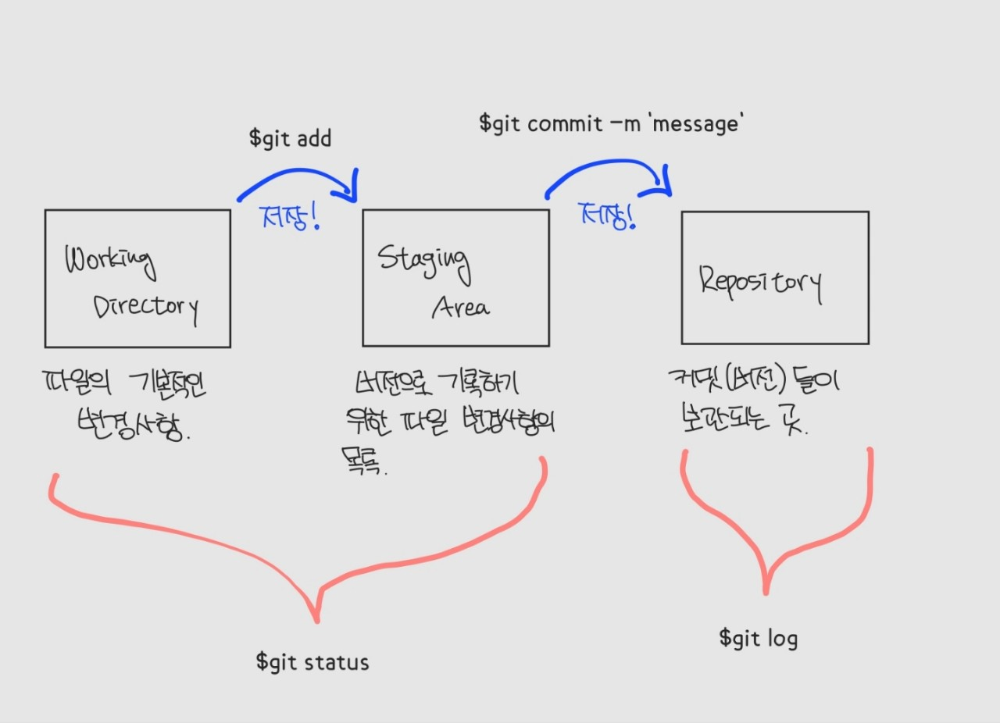
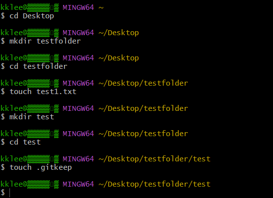
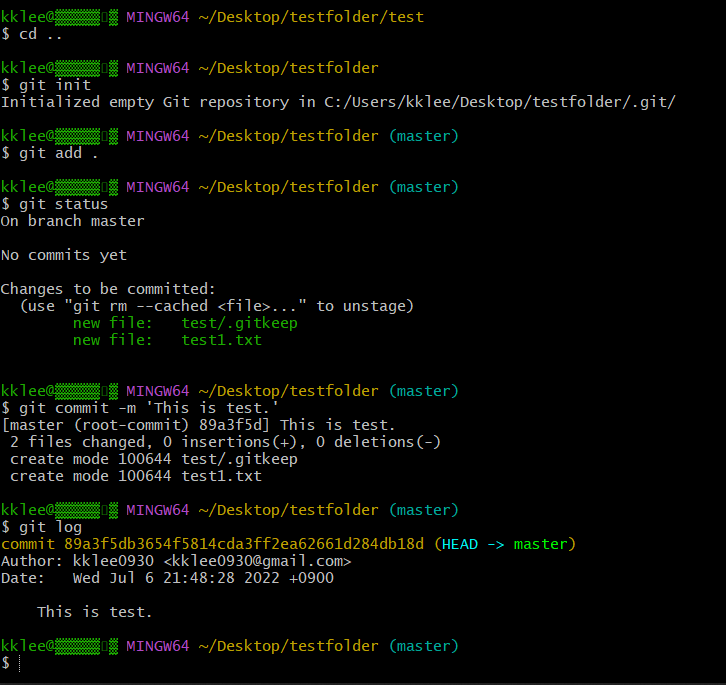
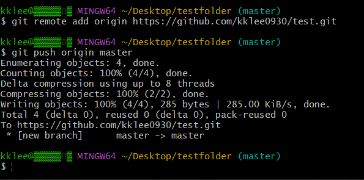
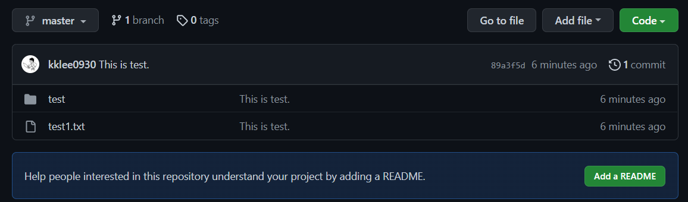

# Git Bash/Git

> Git이란 무엇인가? 짧게 정리하자면 **분산 버전 관리 시스템**, 혹은 **형상 관리 도구** 라고 할 수 있다.  

  
  


## 📖Git

> 버전관리란: 컴퓨터 소프트웨어의 특정 상태를 버전으로 명시하여 개별적으로 관리하는 것

**Git** : 분선 버전 관리 시스템 / 형상 관리 도구

컴퓨터 파일의 변경사항을 추적하고 여러 명의 사용자들 간에 해당 파일들의 작업을 조율하는 것을 돕는다.  
  


### Git 기초 흐름

**분산버전관리 시스템(DVCS) : Distributed Version Control Systems**

- 중앙에서 버전을 관리하고 파일을 받아서(Pull) 사용

- 분산버전관리 시스템은 원격 저장소(Repository)를 통해 저장/관리  

    


**Git의 기본흐름**

1. 작업(수정)하고 [WORKING DIRECTORY]
2. 변경된 파일을 모아 (add) [STAGING AREA]
3. 버전으로 남긴다 (commit) [REPOSITORY]



`Working Directory` : 파일의 변경사항을 생성하는 곳

`Staging Area` : 버전으로 기록하기 위한 변경사항의 목록 (큰틀에서 게임의 테스트 서버. 최종적으로 커밋하기 전에 테스트를 위한 공간)

`Repository` : 커밋(버전)들이 최종적으로 기록되는 곳

  


`modified` : 파일이 수정된 상태(Working Directory에 위치해 있음)

`staged` : 수정한 파일을 곧 커밋할 것이라고 표시한 상태(Staging Area에 위치해 있음)

`committed` : 커밋이 된 상태(Repository에 위치해 있음)

  


## 📖Git Bash 명령어 정리

> Git Bash의 명령어는 Git의 명령어와는 다르게 $git이 붙지 않는다. 

  


`$mkdir foldername` : 폴더 생성 (make directory)

`$pwd` : 현재 working direcory 표시 (print working directory)

`$touch file` : 파일 생성

`$cd ..` : 상위 폴더 이동 (change directory)

`$rm -r foldername` : 폴더 삭제 (remove)

`$rm file` : 파일 삭제

`$ls` : 현재 디렉토리의 파일 목록 표시 (list)

  


## 📖Git 명령어 정리

`$git add <file>` : working directory 상의 변경 내용을 staging area에 추가하기 위해 사용

- untracked 상태의 파일을 staged 상태로 변경

  


`$git commit -m '<message>'` : staged 상태의 파일들을 커밋을 통해 버전으로 기록

- 나중에 되돌아가기 위해서 관리
- 파일 변경 사항들의 스냅샷이라고 생각하면 됨
- 파일들이 변경되었을 때 의도했던 행위를 기록한다고 생각하면 됨

  


`$git status` : Git 저장소에 있는 파일의 상태를 확인하기 위해서 활용

  


`$git log` : 현재 저장소에 기록된 커밋을 조회

- 다양한 옵션을 통해 로그를 조회할 수 있음
  
    
  
  
  - `$git log -1` : 최근 1개 커밋을 보여줘
  
      
    
  - `$git log --oneline` : 커밋내역을 한 줄로 표시해줘
  
      
    
  - `$git log -2 --oneline` : 최근 2개 커밋내역을 두 줄로 표시해줘
  
    
  

`$git remote add origin https://github.com/git_username/repository_name.git` : 로컬저장소와 원격저장소를 연결

  


`$git push origin master` : 로컬 저장소에서 커밋 완료된 파일을 원격저장소에 업로드

  


## ⛔주의사항

1. **(master) 있는 곳에서는 git init을 하지 않는다.**
2. **git 명령어를 입력할 때에는 항상 경로를 잘 보자.**
3. **명령어의 결과 영어를 잘 읽자.**
3. **모든 변경사항은 .git 폴더에 저장된다.**

  


> **💻git을 활용하여 수정/변경/생성한 파일을 add하고 commit 해 보자!**

1. git bash를 실행하여 디렉토리 변경 및 파일 수정/추가 등의 변경을 줘 보자.

```bash
$mkdir testfolder 
$cd testfolder 
$touch test1.txt 
$mkdir test
$cd test
$touch .gitkeep #빈 폴더 test를 commit 하기 위해서 .gitkeep을 추가하였다.
```



  


2. 변경사항을 로컬저장소에 add하고 commit 해보자.

```bash
$cd ..
$git init
$git add .
$git status #git의 Staging area를 확인한다.
$git commit -m 'This is test.'
$git log #commit 기록을 확인한다.
```



  


3. 로컬저장소와 원격저장소를 연결한 후, 커밋된 변경사항들을 원격저장소에 업데이트한다.

```bash
$git remote add origin https://github.com/user_name/repo_name.git
$git git push origin master
```



  


👍정상적으로 push가 된 것을 깃허브를 통해 확인할 수 있다!👍


