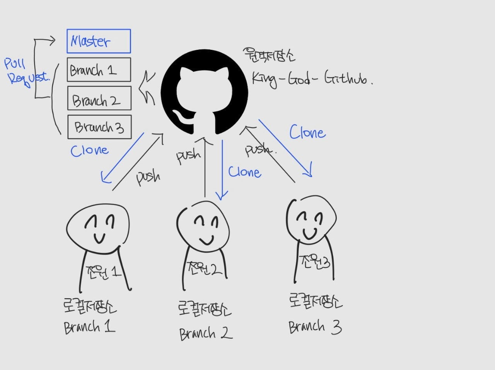
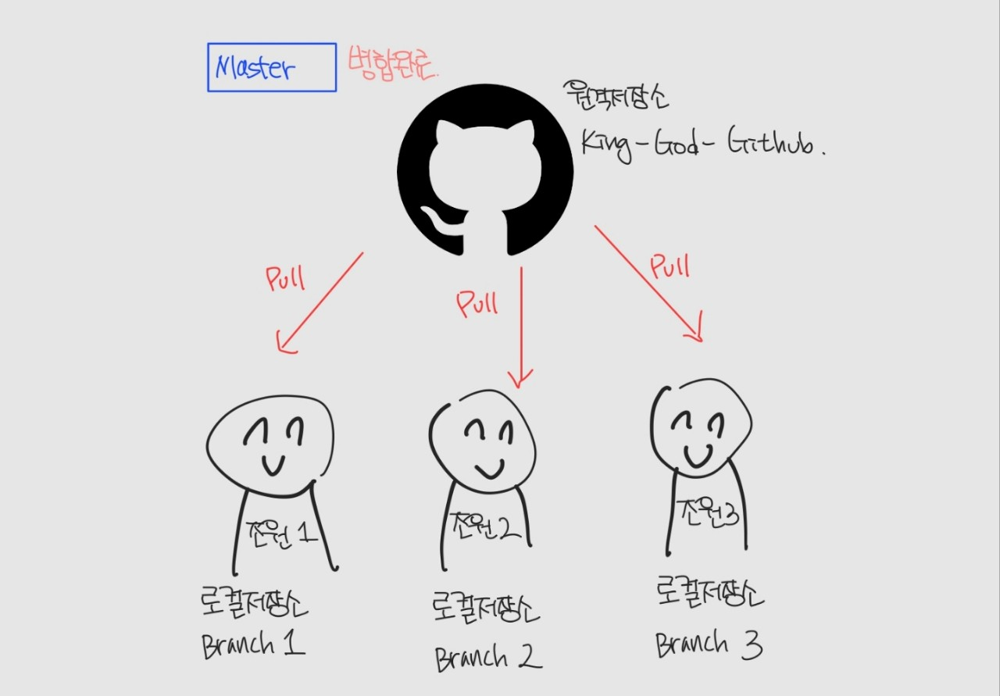
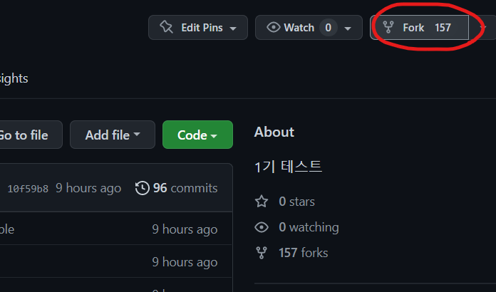
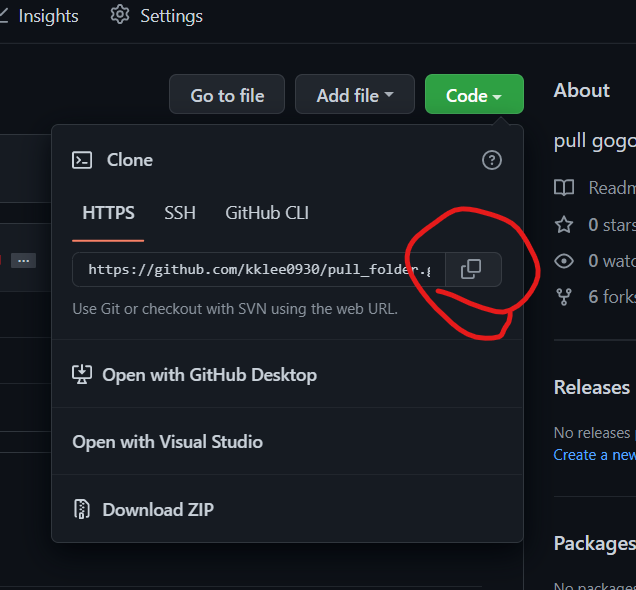
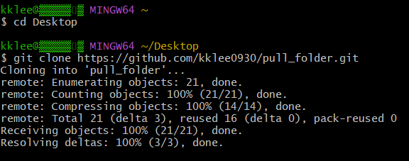

> 어제는 Git Bash의 명령어와 Git의 기본적인 명령어 활용에 대해 배웠다. 배운것을 다시 한 번 복습해보자.

<br>

#### 💻Git을 활용하여 파일을 commit하고 push까지 해보자.

1. 로컬저장소(Working Directory)에서 파일을 변경하고 add 및 commit 해보자.

```bash
$cd Desktop
$mkdir test
$cd test
$git init
$touch test.txt
$git add .
$git commit -m 'test.txt'
```

2. commit한 사항을 원격 저장소에 push 해보자.

```bash
$git remote add origin <url>
$git push origin master
```

<br>

##### 지금까지의 절차는 모두 "혼자" git을 활용한다고 가정할 때 적용 가능하다. 

<br>

🙄만약에 팀원과 협업하여 수정사항을 **공유하고**, 더 나아가 각자의 작업한 결과물을 **하나로 합쳐야 하는 상황**이 발생한다면 어떻게 해야할까? git의 본기능이자 핵심 기능인 branch, merge, pull 에 대해 알아보자!

<br>

앞서 배웠던 **push는 우리가 흔히 아는 "업로드"의 개념**이었다. 반대로 **"다운로드"의 개념**이라고 생각하면 쉬운 것이 바로 **clone과 pull**이다 (이렇게 생각하면 이해하기 쉽다는거지 반드시 같은 개념은 아니다). 

<br>

#### 🤔그래서 clone과 pull의 차이점은 무엇일까?

> Clone

원격저장소에 존재하는 커밋이 현재 로컬저장소에 존재하지 않을 때, 원격저장소에서 커밋을 받아오기 위해 사용된다. 즉 원격저장소를 복제한다.

<br>

> Pull

변경사항이 있을 시 해당 커밋을 받아오기 위해 사용된다. 즉 원격저장소의 커밋을 가져온다.

<br>

#### 💻프로젝트 협업 시 clone과 pull이 사용될 수 있는 예시를 살펴보자.

1. 조장이 저장소를 만든다.

```bash
$cd test
$git init (master)
(master) $git add .
(master) $git commit -m 'message'
(master) $git push origin master
```

<br>

2. 조원들은 clone을 해서 저장소를 받아온다.

```bash
$git clone <url>
```

<br>

3. 이후 각자 수정사항을 commit하고 commit된 사항들에 대해 pull 하여 변경사항을 각자의 로컬 저장소에 적용한다.

```bash
$git pull origin master
```

<br>

지금까지는 git의 "다운로드" 에 초점을 맞춰서 살펴보았다. 더 나아가 전체적 흐름에 대해 살펴보자.

<br>

<br>

> #### git에는 branch라는 것이 존재한다.


<br>

그래서 이 branch가 무엇이냐? 

일단 나는 branch를 **역할군/부서**으로 이해했다. 협업에서는 역할 배분이 이루어지기 마련이고 이에 따른 branch 또한 무수히 생성된다. 이에 따라 생성된 branch 내에서 각자 작업을 수행하고 최종적으로 **master branch가 수행된 commit을 merge** 한다.



<br>

Merge가 완료된 후에는 각자 다시 원격저장소에서 변경사항을 pull 하여 작업을 진행하고 위의 사진과 같은 작업을 반복한다 (단 clone은 하지 않는다!).



<br>

즉 branch는 독립적인 버전들을 만들어나가기 위해서 필수적임을 알 수 있다. 

개발 상황에서는 언제든지 문제가 발생할 수 있고, 때로는 이전 버전으로 되돌아 가야 할 때가 있는데, 이 때 어떤 분야에서 문제가 발생할지 알 수 없기에 각 branch 별로 세부적으로 commit을 기록/관리하여 복구가 용이하게 하기 위해 branch를 활용한다.

<br>

<br>

#### 💻작업시 Branch가 사용되는 예시를 살펴보자.

<br>

⛔주의사항 : 본 예시들은 모두 로컬 저장소에서만 진행되었기에 push 과정이 없다.

<br>

1. 혼자 작업하는 경우 (fast forward)

   1. feature/home이라는 이름의 branch를 생성 및 이동하자.

   ```bash
   $cd Desktop/test
   $git init
   $git branch feature/home
   $git checkout feature/home (feature/home)
   (feature/home) $git branch
   ```

   ​	<br>

   2. 작업완료 후 commit을 해보자.

   ```bash
   (feature/home) $touch home.txt
   (feature/home) $git add .
   (feature/home) $git commit -m 'add home.txt'
   (feature/home) $git log --oneline #log를 확인해보자
   ```

   <br>

   3. master branch로 다시 이동해보자.

   ```bash
   (feature/home) $git checkout master
   (master) $git merge feature/home #master 브랜치에서 feature/home 브랜치를 병합.
   (master) $git log --oneline #브랜치들이 병합된 것을 확인할 수 있다.
   ```

<br>

2. 서로 다른 commit을 merge하는 경우. 각자 commit하고 merge (merge commit)
   1. feature/about branch 생성 및 이동을 해보자.
   
   ```bash
   (master) $git checkout -b feature/about
   (feature/about) $
   ```
   
   <br>
   
   2. 작업 완료 후 commit을 해보자.
   
   ```bash
   (feature/about) $touch about.txt
   (feature/about) $git add.
   (feature/about) $git commit -m 'add about.txt'
   (feature/about) $git log --oneline
   ```
   
   <br>
   
   3. master branch로 이동해보자.
   
   ```bash
   (feature/about) $git checkout master
   (master) $
   ```
   
   <br>
   
   4. master에 추가 commit을 발생시켜보자.
   
   ```bash
   (master) $touch master.txt
   (master) $git add .
   (master) $git commit -m 'add master.txt'
   (master) $git log --oneline
   ```
   
   <br>
   
   5. master에 병합해보자.
   
   ```bash
   (master) $git merge feature/about
   (master) $git log --oneline --graph #브랜치들을 합친 것을 시각적으로 확인 가능하다.
   (master) $git log --oneline #브랜치들이 병합된 것을 확인할 수 있다.
   
   $git branch -d feature/about #병합되고 난 후의 브랜치는 삭제해준다.
   ```

<br>

3. ❗여러명이 **같은 파일**을 commit하고 merge하는 경우 (merge commit conflict)

   1. feature/test branch 생성 및 이동을 해보자.

   ```bash
   (master) $git checkout -b feature/test
   ```

   <br>

   2. 작업 완료 후 commit을 해보자.

   ```bash
   (feature/test) $touch test.txt
   (feature/test) $git add .
   (feature/test) $git commit -m 'test.txt'
   (feature/test) $git log --oneline #feature/test에서 커밋한 내용이 출력된다.
   ```

   <br>

   3. master branch로 다시 이동해보자.

   ```bash
   (feature/test) $git checkout master
   (master) $
   ```

   <br>

   4. master에서 같은 파일에서의 commit을 발생시켜보자.

   ```bash
   (master) $git touch test.txt
   (master) $git add .
   (master) $git commit -m 'test.txt'
   (master) $git log --oneline #master에서 커밋한 내용이 출력된다.
   ```

   <br>

   5. master에 병합해보자.

   ```bash
   (master) $git merge feature/test
   ```

   <br>

   🥵같은 파일을 이와같이 여러명이 수정하게 되면 충돌이 일어날 확률이 매우 높다. 따라서 팀원과 의논을 통해 이 부분은 해결하자.

   <br>

   <br>

### Feature branch workflow VS Forking workflow

branch, pull, merge를 활용하여 협업이 이루어지는 것을 배웠다. merge와 pull을 하기 위해선 저장소에 직접 접근할 수 있는 권한이 필요한데 만약 이 권한이 없다면 어떻게 할까? 저장소가 내 저장소가 아니라 다른 사람의 것이라면,,,?

<br>

저장소의 소유권 유무에 따라 workflow(일의 처리 흐름) 또한 두 가지로 나뉜다.

- feature branch workflow (shared repository model) : 저장소의 소유권이 있는 경우
- forking workflow (Fork and Pull model) : 저장소의 소유권이 없는 경우

<br>

이전에 설명한 예시들은 모두 저장소에 대한 소유권이 있는 경우에서 진행한 것이다. 저장소에 대한 소유권이 없는 상황에서의 프로젝트 참여에 대해 알아보도록 하자.

<br>

<br>

#### 💻Fork and Pull request의 예시를 알아보자.

<br>

Repo에 접근하여 Fork를 하자.



<br>

Fork한 Repo의 URL을 복사하자(반드시 나의 Repo의 URL을 복사해야 한다!)



<br>

`$git clone URL` 해서 로컬저장소로 가져오고 PR용 branch를 생성한다.



```bash
$git checkout -b test
```

<br>

이후 수정과 commit 과정을 거치고 PR용 branch에 push를 한다.

```bash
$git add .
$git commit -m 'message'
$git push origin test
```

<br>

이후에 fork를 했던 나의 저장소에 들어가면 create request를 할 수 있다.

