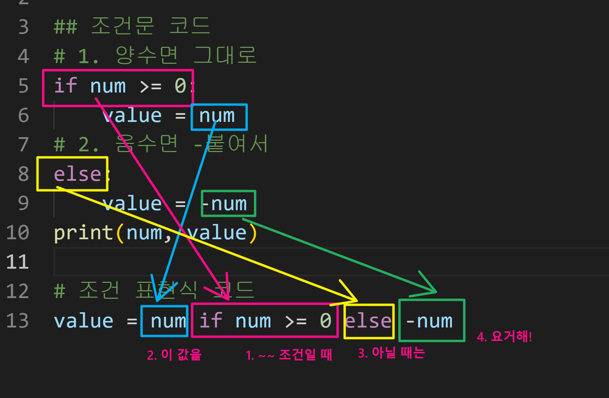

### 💻제어문(Control Statement)

- 파이썬은 **위에서부터 아래로 순차적**으로 명령을 수행한다.
- 특정한 상황에 따라 코드를 **분기적으로 혹은 반복적**으로 실행할 때 사용한다.
- 순서도(flow chart)로 표현이 가능하다.

ex:

```python
if <expression>:
    #Run this code block
else:
    #Run this code block
    
#코드블럭은 indentation으로 구분된다.
```

```python
#a가 음수인지 양수인지 판단해 보아라.
a = -10
if a >= 0:
    print('양수')
else:
    print('음수')
```

```python
#a가 홀수인지 짝수인지 판단해 보아라.
if a % 2 == 0:
    print('짝수')
elif a % 2 == 1:
    print('홀수')
```

```python
#조건문을 통해 변수 num 값의 홀수/짝수 여부를 출력하시오.
#이때 num은 input을 통해 사용자로부터 입력을 받으시오.
num = int(input())
if num % 2 == 0:
    print('짝수')
elif num % 2 == 1:
    print('홀수')
```

<br>

### 💻복수 조건문

```python
#미세먼지 농도에 따라 등급을 출력을 해보자.
dust = int(input('오늘의 미세먼지 농도는?: '))
if dust > 150:
    if dust > 300:
        print('실외활동을 자제하세요.')
    print('미세먼지 농도 매우나쁨')
elif dust > 80:
    print('미세먼지 농도 보통')
elif dust > 30:
    print('미세먼지 농도 좋음')
elif dust < 0:
    print('음수값입니다.')
```

<br>

### 💻조건 표현식(Conditional Expression)

- 문법을 조금 더 간결하게 표현할 수 있도록 하는 기능이다.
- 값을 조건에 따라 할당하려고 할 때 사용한다.

```python
#num이 정수일 때, 아래의 코드는 무엇을 위한 코드일까?
value = num if num >= 0 else -num

if num >= 0:
    value = num
else:
    value = -num
print(num, value)
#와 아래의 코드는 같은 의미이다.

value = num if num >= 0 else -num
```



```python
#예시 (아래와 같은 경우일 때만 사용하도록 하자)
num = 2 
if num % 2 == 1:
    result = '홀'
else:
    result = '짝'
    
    
result = '홀' if num % 2 == 1 else '짝'
```

#### ⛔복잡한 코드일 때는 절대 사용하지 말자. 가독성이 심각하게 떨어지게 된다.

<br>

### 💻반복문

- while문

  - **종료조건에 해당하는 코드**를 통해 **반복문을 종료**시킨다.
  - **조건이 참**인 경우 들여쓰기 되어 있는 코드 블록이 **무한정 반복실행**된다.
  - 코드 블록이 모두 실행되고, 다시 조건식을 검사하며 반복적으로 실행된다.
  - 따라서 무한루프를 돌지 않도록 **종료조건이 반드시 필요**하다.

  ```python
  while <expression>:
      #Run this code block
  ```

  ```python
  #1부터 사용자가 입력한 양의 정수까지의 총합을 구하는 코드를 작성하시오.
  n = 1
  total = 0
  user_input = int(input())
  while n <= user_input:
      print(f'n: {n}, total: {total}')
      total += n
      n += 1
  print(total)
  ```

  <br>

- for문

  - 시퀀스(string, tuple, list, range)를 포함한 순회가능(iterable)한 객체 요소를 모두 순회한다.
  - **처음부터 끝까지 모두 순회**하므로 별도의 종료조건이 필요하지 않다.
  - 반복가능한 객체를 모두 순회하면 종료한다.

  ```python
  for fruit in ['apple', 'mango', 'banana']:
      print(fruit)
  print('끝')
  ```

  ```python
  #사용자가 입력한 문자를 한 글자씩 세로로 출력하시오.
  chars = input()
  for i in chars:
      print(i)
  ```

  ```python
  #사용자가 입력한 문자를 range를 활용하여 한 글자씩 출력하시오.
  chars = input()
  for i in range(len(chars)):
      print(chars[i])
  ```

  <br>

- enumerate 순회

  - **인덱스와 객체를 쌍**으로 담은 열거형(enumerate) 객체를 반환한다.
  - **(index, value) 형태의 tuple로 구성된 열거 객체**를 반환한다.
  - 기본값 0, start를 지정하면 해당 값부터 순차적으로 증가한다.

  ```python
  #아래를 enumerate로 변환하라.
  members = ['철수', '영희', '민수']
  for i in range(len(members)):
      print(f'{i}: {members[i]}')
  
  for i, member in enumerate(member):
      print(i, member)
  ```

  <br>

- dictionary 순회

  - 딕셔너리는 기본적으로 key를 순회하며, key를 통해 값을 활용한다.

  ```python
  grades = {'john': 80, 'eric': 90}
  for name in grades:
      print(name) #john, eric을 순차적으로 출력한다(key를 순회하여 출력한다).
      
  for name in grades:
      print(name, grades[name]) #을 써야 john 80, eric 90을 출력한다.
  ```

<br>

### 💻반복문 제어

- break

  - 반복문을 바로 종료한다.

    ```python
    n = 0
    while True:
        if n == 3:
            break
        print(n)
        n += 1 # 0, 1, 2
    ```

    ```python
    for i in range(10):
        if i > 1:
            print('0과 1만 필요해.')
            break
        print(i) # 0, 1, 0과 1만 필요해.
    ```

    <br>

- continue

  - continue 이후의 코드 블록은 수행하지 않고, 다음 반복을 수행한다.

    ```python
    for i in range(6):
        if i % 2 == 0:
            continue # 2로 나누었을 때의 나머지가 0이면 반복문을 스킵하고 바로 print한다.
        print(i) # 1, 3, 5
    ```

    <br>

- for-else

  - 끝까지 반복문을 실행한 이후에 else문을 실행한다.

  - 끝까지 반복문을 실행하면 실행되는 코드이다.

    ```python
    for char in 'apple':
        if char == 'b':
            print('b!')
            break
    else:
        print('b가 없습니다.') # b가 없습니다.
    ```

    ```python
    for char in 'banana':
        if char == 'b':
            print('b!')
            break
    else:
        print('b가 없습니다.') # b!
    ```


