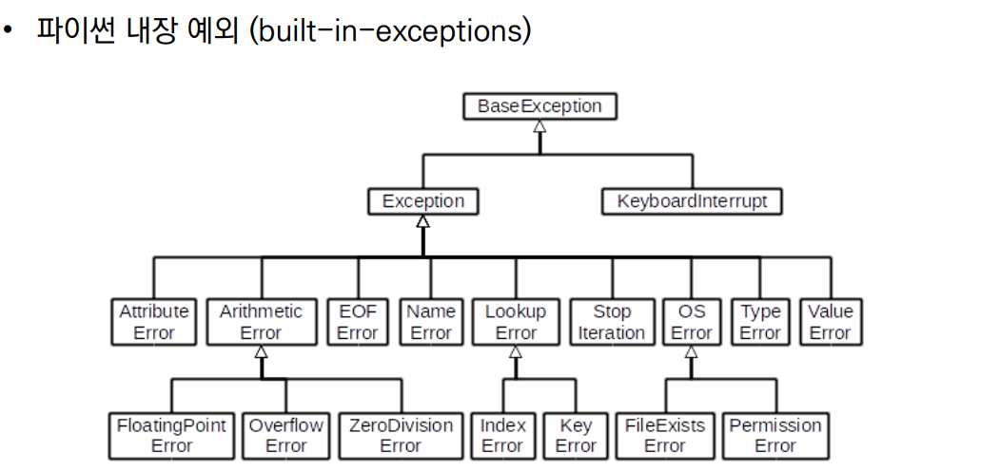

### 💻디버깅이란:

개발 과정에서 발생하는 오류를 찾아내고 원인을 확인 및 분석하여 수정하는 작업이다.<br><br>

### 💻어느 부분을 중점적으로 봐야할까?

- branches: 모든 조건이 원하는대로 동작하는지 확인.

- for loops: 반복문에 진입하는지, 원하는 횟수만큼 실행되는지 확인.

- while loops: 종료조건이 제대로 작동하는지 확인.

- function: 함수 호출 시, 함수 파라미터, 함수 결과에 문제가 없는지 확인.<br><br>

### 💻디버깅을 어떻게 하는게 좋을까?

- print 함수 활용:

  - 특정 함수 결과, 반복/조건 결과 등 나눠서 생각

  - 코드를 bisection으로 나눠서 생각
  - 개발 환경 등에서 제공하는 기능 활용

- breakpoint, 변수 조회 등 기능을 활용<br><br>

### 💻코드를 작성하다가...

- 로직에러가 발생하는 경우:

  1. 정상적으로 동작하였던 코드 이후 작성된 코드를 생각해봄

  2. 전체 코드를 살펴봄

  3. 휴식을 가져봄

  4. 누군가에게 설명해봄<br><br>

### 💻문법 에러(Syntax Error)

- EOL(End of Line): 코드의 줄(line)이 제대로 작성되지 않음.

  ex:

  ```python
  print('hello
  ```

- EOF(End of File): 파일명이 정확하게 작성되지 않음.

  ex:

  ```python
  print(
  ```

- Invalid Syntax: 유효하지 않은 문법ㅡ

  ex:

  ```python
  while
  ```

- Cannot assign to literal: 변하지 않는 지정수(리터럴)에 값을 할당하려고 할 때 발생.

  ex:

  ```python
  5 = 3
  ```

  <br>

### 💻예외(Exception):

Syntax 상으로는 문제가 없지만 예상치 못한 상황이 생기면 발생하는 오류

1. ZeroDivisionError: 0으로 나누고자 할 때 발생

   ```python
   10/0
   ```

2. NameError: namespace 상에 이름이 없는 경우 (LEGB 상에 이름이 존재하지 않는 경우)

   ```python
   print(name_error)
   ```

3. TypeError: `1 + '1'`, `round('3.5')`

4. ValueError: 타입은 올바르나 값이 적절하지 않은 경우 `int('3.5')`, `range(3).index(6)`

5. IndexError: list index out of range

   ```python
   empty_list = []
   empty_list[2]
   ```

6. KeyError: 명시한 key가 딕셔너리에 존재하지 않을 때 발생

   ```python
   song = {'IU': '좋은날'}
   song['BTS']
   ```

7. ModuleNotFoundError: 존재하지 않는 모듈을 import 하는 경우

   ```python
   import nonamed
   ```

8. ImportError: `from random import samp` Module은 존재하나, 존재하지 않는 클래스/함수를 가져오는 경우(random은 있는데 import한 samp는 없는 경우)

   ```python
   from random import samp
   ```

9. IndentationError: 들여쓰기를 하지 않거나 띄우기에 오류가 있는 경우

   ```python
   for i in range(3):
   print(i)
   ```

10. KeyboardInterrupt: 임의로 프로그램을 종료하였을 때 `ctrl+c`

<br><br>

### 💻예외처리:

소프트웨어를 만들 때 적극적으로 활용한다. 에러가 발생했을 때 다른일을 하도록 지시한다.

- try/except절을 이용하여 예외 처리를 할 수 있음

  - try: 오류가 발생할 가능성이 있는 코드를 실행한다.
    <br><br>

- 예외 발생하지 않으면, except 없이 실행 종료된다.

  - except: try에서 예외가 발생할 경우 실행한다.

```python
# 100을 사용자가 입력한 숫자로 나눠서 출력
number = input()

try:
    print(100/int(number))

except ZeroDivisionError as zeroerr:
    print(zeroerr) # division by zero
    print('0으로 나눌 수는 없습니다.')

except ValueError:
    print('숫자를 입력하세요.')

except Exception:
    print('오류')
```

```python
# 복수의 예외처리도 가능하다.
try:
    print(100/int(number))

except ZeroDivisionError, ValueError, Exception:
    print('오류가 발생했습니다.')
```

<br>

`finally`: 예외 발생 여부와 관계없이 항상 실행한다.

```python
#파일을 열고 읽는 코드를 작성하는 경우
try:
  f = open('file.txt')
except FileNotFoundError:
  print('해당 파일이 없습니다.')
else:
  print('파일을 읽기 시작합니다.')
  print(f.read())
  print('파일을 모두 읽었습니다.)
  f.close()
finally:
  print('파일 읽기를 종료합니다.')
```

<br>

### 💻예외를 발생 시키기

`raise`: 에러를 명시하고 의도적, 강제적으로 발생시킨다.

`raise <표현식>(Message)`
