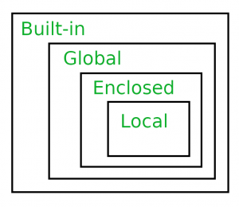

### 💻Self:

<br>

호출하는 인스턴스를 파이썬 **내부적으로** 그대로 전달해준다.

```python
#self는 인스턴스가 지니는 값을 넘겨주는 역할을 한다.
class Person:
    # self가 자동으로 넘어가기 때문에 name만 입력해주면 되는 것이다.
    def __init__(self, name):
        self.name = name

    def greeting(self):
        print(f'안녕하세요, {self.name}입니다.')

        # 아래는 출력이 안된다. 왜나햐면 인스턴스가 지니는 name 값을 불러올 수 없기 때문에
        print(f'안녕하세요, {name}입니다.')

gildong = Person('길동')
gildong.greeting()
```

<br>

로또 번호 자동생성기를 함수화 해보자.

```python
import random

# 5장 구입
for i in range(5):
    number = range(1,46)
    result = random.sample(number)
    result.sort()
    print(result)

# 함수화 해보자.
def lotto(n):
    lotto_list = []
    for i in range(n):
        number = range(1,46)
        result = random.sample(number, 6)
        result.sort()
        lotto_list.append(result)
    print(lotto_list)

# 다른 환경에서 import 해서 사용할 때
import lotto
print('파일명'.lotto_generator(5))
```

<br>

로또 번호 자동생성기를 여러 기능을 지니는 클래스로 만들어보자.

```python
import random

class Lotto:
    def __init__(self):
        self.list = []

    def number_generator(self, n):
        for i in range(1, n+1):
            numbers = random.sample(range(1,46), 6)
            numbers.sort()
            self.list.append(numbers)
        return self.list

    def check_number(self, real_num):
        for i in self.list:
            if i == real_num:
                return 'Congrats! You won the lottery!'
            else:
                return 'Next time... Maybe?'

l1 = Lotto()
print(l1.number_generator(2))
print(l1.check_number([1]))
```

<br>

### 💻클래스

<br>

클래스 속성(attribute):

- 한 클래스 내의 모든 인스턴스가 지니는 공통된 같은 값을 클래스 속성이라고 한다.

- 클래스 선언 내부에서 정의된다.

- `<classname>.<name>`으로 접근 및 할당이 가능하다.

```python
#클래스 변수를 정의한다.
class Circle:
    pi = 3.14

c1 = Circle()
c2 = Circle()

# 이미 클래스 내에 변수로써 pi = 3.14 가 정의되어 있기 때문에 인스턴스는 모두 같은 pi값을 지닌다.
print(c1.pi) # 3.14
print(c2.pi) # 3.14
```

<br>

### 💻LEGB Rule

<br>

L: `Local` (함수 내부를 의미한다. 지역변수가 하나의 예가 될 수 있겠다.)

E: `Enclosed Functional locals` (함수 내부의 기준으로 바깥 쪽을 의미한다. Global과 Local 사이의 범위이다.)

G: `Global` (함수영역에는 포함되지 않는 함수 바깥쪽 영억, 가장 바깥영역을 뜻한다. 함수 밖에서 선언되는 전역변수가 하나의 예가 될 수 있겠다.)

B: `Built-in` (파이썬 모듈 내부인 내장영역을 뜻한다. 파이썬의 reserved words 등이 이에 해당한다.)

<br>



<br>

### 💻인스턴스와 클래스 간의 이름 공간(namespace):

<br>

인스턴스 객체를 통해 함수의 이름을 찾을 때,

`인스턴스 객체 영역 ->> 클래스 객체 영역 ->> 전역 영역` (LEGB와 같은 순서) 순으로 탐색하게 된다.

탐색하지 못한 경우에는 AttributeError 예외가 발생한다.

<br>

⛔클래스 내에서 변수에 접근하려고 할 시에, 반드시 self를 통해 접근하여야 한다. 전역변수와 클래스 내의 변수의 이름이 동일할 경우 문제가 발생할 수 있다.

```python
str = 'Global variable'
class test:
    str = 'Class variable'

    def set(self, msg):
        self.str = msg

    def Print(self):
        print(str) # self.str을 하지않아 전역 변수를 호출한다.

    def PPrint(self):
        print(self.str) # 클래스 변수를 호출한다.

t1 = test()
t1.Print() # Global variable
t1.PPrint() # Class variable
```

<br>

### 💻인스턴스 메서드

<br>

함수가 인스턴스를 호출하면서 인스턴스에 메서드 사용이 필요할 때 사용한다. 쉽게 말해서 인스턴스를 조작하기 위한 메서드이다.

<br>

### 💻클래스 메서드

<br>

- 내부적으로 클래스에 메서드 사용이 필요할 때 사용한다.

- 클래스가 사용할 메서드이다.

- 오직 클래스만을 위한 메서드이다. 클래스에만 적용된다.

- `@classmethod` 데코레이터를 사용하여 정의한다.

- 데코레이터: 함수를 어떤 함수로 꾸며서 새로운 기능을 부여한다.
  - 호출 시, 첫번 째 인자로 클래스(cls)가 전달된다.

```python
class MyClass:

    @classmethod
    def class_method(cls, args1)
```

<br>

### 💻스태틱 메서드

<br>

- 인스턴스 변수, 클래스 변수를 전혀 다루지 않는 메서드이다.

- 속성을 다루지 않고 행동 및 기능만을 정의할 때 사용된다.

- 호출 시 어떠한 인자도 전달되지 않으며 클래스 정보에 접근/수정을 할 수 없다.

```python
class MyClass:

    #클래스 차원에서 사용할 수 있는 변수
    class_variable = '클래스변수'

    def __init__(self):
        self.instance_variable = '인스턴스 변수'

    #인스턴스 메서드 정의
    def instance_method(self):
        return self, self.instance_method

    #클래스 메서드 정의
    @classmethod
    def class_method(cls):
        return cls, cls.class_variable

    #스태틱 메서드 정의
    @staticmethod
    def static_method():
        return '스태틱'

c1 = MyClass()
print('인스턴스 변수 호출', c1.instance_variable)
print('인스턴스 메서드 호출', c1.instance_method())
print('클래스 메서드 호출', c1.class_method())
print('스태틱 메서드 호출', c1.static_method())
```

<br>

### 💻객체 지향의 핵심개념

<br>

- 객체지향의 핵심 4가지

1. 추상화: 클래스 내에 기능들을 만들어 놓고 인스턴스 생성 시, 기능을 이용할 수 있게 해주는 개념이다. 이러한 형태를 미리 만들어 놓는 것을 추상화라고 한다.

```python
class Person:
    def __init__(self, name):
        self.name = name

    def introduce(self):
        return f"hi, I'm {self.name}."
```

<br>

2. 상속: 두 클래스 간의 부모-자식 관게를 정립하는 것이다. 상속을 통해 상위 클래스에 정의된 속성, 행동, 관계 및 제약조건을 모두 하위 클래스에게 전달이 가능하다. 재사용성이 향상된다는 장점이 있다.

```python
class Human:
    def __init__(self, name):
        self.name = name

    def work(self):
        print(self.name + 'works hard')

class Student(Human):
    def work(self):
        print(self.name + 'studies hard')

class Teacher(Human):
    def work(self):
        print(self.name + 'teaches with effort')
```

- `isinstance(object, classinfo)`: 실제로 인스턴스인지 확인 가능

```python
class Human:
    def __init__(self):
        return None

class Animal:
    def __init__(self):
        return None

h1 = Human()
a1 = Animal()

print(isinstance(h1, Human)) # True
print(isinstance(a1, Human)) # False
```

- `issubclass(class, classinfo)`: 상속관계인지 알아보는 메서드

  - classinfo는 클래스 객체의 튜플일 수도 있으며, classinfo의 모든 항목을 검사한다.

```python
class Human:
    def __init__(self, name):
        self.name = name

    def work(self):
        print(self.name + 'works hard')

class Animal:
    def __init(self):
        return None

class Student(Human):
    def work(self):
        print(self.name + 'studies hard')

class Tiger(Animal):
    def hunt(self, target):
        print('Tiger is approaching to the pray')

print(issubclass(Student, Human)) # True
print(issubclass(Tiger, Human)) # False
```

- `super()`: 부모클래스의 요소를 호출할 수 있다. 자식클래스에서 부모 클래스를 사용하고 싶은 경우
  활용한다.

  - `super().__init__(name, age)`이런식으로 코드를 다시 작성할 필요 없이 새로 추가하고 싶은 값만 추가할 수 있다.

```python
class Person:
    def __init__(self, name, age, number, email):
        self.name = name
        self.age = age
        self.number = number
        self.email = email

class Student(Person):
    def __init__(self, name, age, number, email, student_id):
        super().__init__(name, age, number, email)
        self.student_id = student_id
```

<br>

- 메서드 오버라이딩(method overriding)을 통해 자식 클래스에서 메서드의 재정의가 가능하다.

- 상속관계에서의 이름 공간은 인스턴스, 자식 클래스, 부모 클래스 순으로 탐색한다(작은 것부터 큰 것으로)

<br>

    🌟다중상속: 두개 이상의 클래스를 상속 받는 경우, 상속 받은 모든 클래스의 요소를 활용이 가능하다.
    중복된 속성이나 메서드가 있는 경우 상속 순서에 의해 결정된다.

<br>

3. 다형성: 동일한 메서드가 상속 받는 자식 클래스에 따라 조금 다르게 정의되는 개념이다.

- 메서드 오버라이딩(method overriding): 메서드 덮어쓰기 기능이다. 메서드를 재정의 하는 것이다.

```python
#다형성과 메서드 오버라이딩
class Human:
    def __init__(self, name):
        self.name = name

    def work(self):
        print(self.name + 'works hard')

class Student(Human):
    def work(self):
        print(self.name + 'studies hard')

class Teacher(Human):
    def work(self):
        print(self.name + 'teaches with effort')
```

<br>

4. 캡슐화: 파이썬에서는 접근 제어를 지원하지 않는데, 수단과 방법을 다 쓰면 접근이 가능하기 때문이다.

- 접근 제어자 종류

1. Public Access Modifier: 어디서나 호출이 가능하다. 하위 클래스 override를 허용한다.

   - 언더바 없이 시작하는 메서드나 속성이다.

<br>

2. Protected Access Modifier: 부모/자식 간에만 호출이 가능하다.

   - 언더바 1개로 시작하는 메서드나 속성이다.

<br>

3. Private Access Modifier: 본인만 접근이 가능하다. 클래스 그 자체에서만 가능하다는 뜻이다.

   - 언더바 2개로 시작하는 메서드나 속성이다.

<br>

## References

https://wikidocs.net/80519

https://yes90.tistory.com/48

https://www.geeksforgeeks.org/scope-resolution-in-python-legb-rule/

https://goodgid.github.io/Python3(3)-(2)/

http://www.tcpschool.com/java/java_polymorphism_concept

https://www.w3schools.com/java/java_polymorphism.asp

https://www.fun-coding.org/PL&OOP1-8.html
