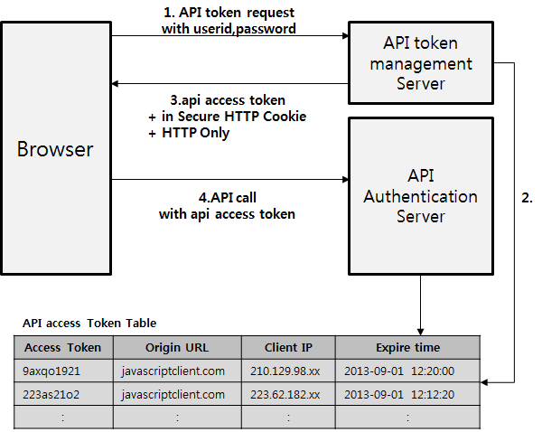

### 💻API란 무엇인가?

API: Application Programming Interface

- 컴퓨터나 컴퓨터 프로그램 사이를 연결시켜준다.
- 일종의 소프트웨어 인터페이스이며 다른 종류의 소프트웨어를 서비스에 제공한다.
- 프로그램으로 제어하는 것이다.

> API란 어떤 응용 프로그램이 기상청의 예제를 통해 살펴본것처럼 API는 어떤 응용프로그램이 자신이 가지고 있는 정보를 제공하기 위해 어떤 방식으로 통신할것인지에 대한 규격을 만들게되고, 이러한 규격을 API라고 표현한다.

<br>

#### 🌟즉, 한마디로 프로그램을 제어할 수 있도록 도와주는 일종의 프로그램(인터페이스)이다.

<br>

### 💻그렇다면 인터페이스(Interface)는 또 무엇일까?

> 인터페이스란, 인터페이스(interface)는 컴퓨터 시스템끼리 정보를 교한하는 공유 경계를 의미한다, 터치 스크린과 같은 일부 컴퓨터 하드웨어 장치들은 인터페이스를 통해 데이터를 송수신 할 수 있으며, 마우스나 마이크론 폰가 같은 장치들은 오직 시스템에 데이터를 전송만 하는 인터페이스를 제공한다.

 <br>

### 💻쉽게 이해할 수 있도록 일상에서의 유사한 예시를 찾아보자!:

TV를 조작하기 위한 인터페이스는: remote control

### 💻API를 사용하기 전에 확인해야 할 것:

요청하는 방식에 대한 이해

- 인증방식: 보통 인증 방식에는 크게 2가지가 있다.

1. API 키 방식: 개인에게 문자열 형식으로 이루어진 키를 부여하고 사용자는 API 호출 시마다 해당 키를 메시지 안에 넣어서 호출한다. 서버는 메시지 안에서 API 키를 읽어서 누가 호출한 API인지 인증하게 된다.

2. API 토큰 방식: API 토큰을 발급하여 ID, 비밀번호 등으로 특정 기간 동안 유효한 API토큰을 발행하여 그 토큰으로 사용자를 인증하는 방식이다. 왜 이런 방법을 쓸까? 토큰을 발행하여 사용할 경우, 개인정보 탈취 및 유출의 위험이 적다는 장점이 있다.

   <br>

   

#### 🌟위의 그림을 보면 다음과 같은 형태로 인증이 이루어진다.

1. API 클라이언트가 사용자 ID, 비밀번호를 보내서 API 호출을 위한 API 토큰을 요청한다.

2. API 인증 서버는 사용자 ID, 비밀번호를 바탕으로 사용자를 인증한다.

3. 인증된 사용자에 대해서 API 토큰을 발급한다 (유효시간을 가지고 있다.)

4. API 클라이언트는 이 API 토큰으로 API를 호출한다. API 서버는 API 토큰이 유효한지를 API 토큰 관리 서버에 문의하고 API 토큰이 유효하면 API 호출을 받아들인다.

<br>

🌟그 밖에 API 사용시 숙지 및 주의사항

API에 대해서 깊게 다루지 않았으므로 의문점이나 자료가 필요할 때마다 적극 검색하여 공부하도록 하자.

[API 활용 프로젝트](https://github.com/kklee0930/01-PJT-01)

- URL 생성

  - 기본 주소

  - 원하는 기능에 대한 추가 경로

  - 요청 변수 (필수와 선택)

- 응답 결과에 대한 이해

  - 응답 결과 타입(json)

  - 응답 결과 구조

```python
import requests

order_currency = 'BTC'
payment_currency = 'KRW'
URL = f'https://api.bithumb.com/public/ticker/{order_currency}_{payment_currency}'

response = requests.get(URL)
# response의 타입 출력
print(response, type(response))

# status code 출력
print(reponse.status_code)

# text 형식으로 출력
print(response.text)

# .json() 텍스트 형식의 파일을 파이썬에서 알아볼 수 있는 형식으로 변환해준다.
print(response.json(), type(response.json()))
```

<br>

## References

https://dongwooklee96.github.io/post/2021/03/28/rest-api-%EB%B3%B4%EC%95%88-%EB%B0%8F-%EC%9D%B8%EC%A6%9D-%EB%B0%A9%EC%8B%9D.html (REST API 보안 및 인증 방식)

https://steemit.com/kr/@yahweh87/it-api (API란 무엇인가?)

https://blog.wishket.com/api%EB%9E%80-%EC%89%BD%EA%B2%8C-%EC%84%A4%EB%AA%85-%EA%B7%B8%EB%A6%B0%ED%81%B4%EB%9D%BC%EC%9D%B4%EC%96%B8%ED%8A%B8/ (API의 유형)

https://aws.amazon.com/ko/what-is/api/ (API란 무엇인가)
