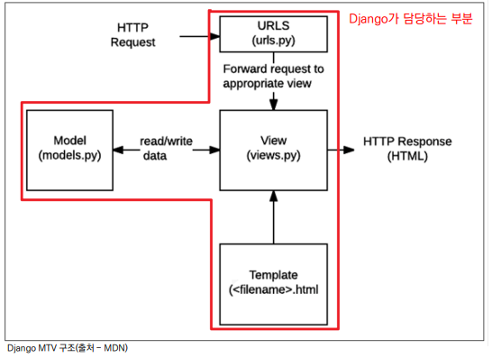

### 💻Framework

- 기능 구현을 위해 미리 만들어놓은 코드를 재사용하는 것은 생산성, 품질 측면에서 굉장한 이득이다

- 이러한 코드를 모아 놓은 것, 서비스 개발에 필요한 기능을 미리 구현해서 모아 놓은 것이 Framework이다

<br>

### 💻Web

World Wide Web(www) == Internet == Web

<br>

### 💻Client and Server

웹 서비스에서

- 클라이언트(request를 보냄)

- 서버(request를 받아서 response를 보냄)

#### 클라이언트

- 웹 사용자의 인터넷에 연결된 장치(wifi에 연결된 컴퓨터나 모바일 기기)

- Chrome 또는 Firefox 같은 웹 브라우저

- 서비스를 요청하는 주체를 "클라이언트"라고 칭한다.

<br>

#### 서버

- 웹 페이지, 사이트 또는 앱을 저장하는 컴퓨터

- 클라이언트가 웹페이지에 접근 시 서버에서 클라이언트에게 페이지 데이터를 응답하여 사용자의 브라우저에 표시됨

🌟우리가 배우게 될 Django는 서버를 구현하기 위한 웹 프레임워크이다.

<br>

### 💻Web browser / Web page

#### 웹 브라우저란

- 웹에서 페이지를 찾아 보여주고, 사용자의 하이퍼링크를 통한 페이지 이동을 도움

- 웹 페이지 파일을 우리가 보는 화면으로 전환해주는 (렌더링, rendering) 프로그램

  - 이 렌더링 과정에는 JS파일, CSS파일, HTML파일을 받아오는 과정 또한 포함

#### 웹 페이지란

- 우리가 보는 화면 각각 한 장 한 장이 웹 페이지

웹 페이지 종류에는

- 동적 웹 페이지

- 정적 웹 페이지

가 있다.

#### 정적 웹 페이지(static)

- 한 번 작성된 페이지가 내용 변화 없이 사용자에게 동일한 모습으로 전달되는 것

예시: 서버에 미리 저장된 HTMl 파일 그대로 전달된 웹 페이지(Notion 페이지, 기업 소개 페이지)

#### 동적 웹 페이지(dynamic)

- 사용자 요청에 따라 추가적인 수정이 발생하여 클라이언트에게 전달되는 웹 페이지

- 위의 수정 작업을 위해서는 서버가 필요함

  - 서버에서 동작하는 프로그램이 클라이언트의 요청을 받아서 적절한 응답을 만들어줌

  - 이를 다루는 프레임워크가 우리가 배울 Django이다

<br>

### 💻Django의 구조(MTV Design Pattern)

#### 디자인 패턴(Design Pattern)이란

- 소프트웨어의 구조를 일반화하여 하나의 공법으로 정의한 것

- 소프트웨어 개발 시 공통적인 설계 문제가 존재하는데 이를 처리하는 해결책 사이에도 공통점이 있는데 이를 디자인패턴으로 칭한다

- 앞서 다뤘던 클라이언트-서버 구조도 소프트웨어 디자인패턴 중 하나이다

#### 그래서 디자인 패턴을 왜 쓰는가?(목적)

- 공통적으로 발생하는 문제에 대한 해결책 제시가 용이

- 시스템 디자인 시 발생하는 공통된 문제들을 해결하는데 형식화 된 가장 좋은 관행

##### 장점

- 커뮤니케이션이 간단해짐

  - 구구절절 설명할 필요없이 "이 프로젝트에는 이 디자인패턴 씁시다!" 한마디로 해결가능

#### MVC 소프트웨어 디자인 패턴

MVC: Model View Controller

데이터 및 논리 제어를 구현하는데 널리 사용되는 소프트웨어 디자인 패턴

- Model: 데이터와 관련된 로직 처리

- View: 레이아웃과 화면 처리

- Controller: 명령을 model과 view 부분으로 연결

🌟MVC 패턴을 사용함으로써 독립적인 개발이 가능하여, 유지보수가 용이하다

#### MTV 소프트웨어 디자인 패턴

MVC 패턴을 기반으로, 크게 다른 점은 없으며 일부 역할에 대해 부르는 이름이 다름

- Model == Model

- View == Template

- Controller == View

##### Model

- 데이터와 관련된 로직 관리

- 응용프로그램의 데이터 구조 정의 및 DB 기록 관리

##### Template

- 레이아웃 및 화면 처리

- 사용자 인터페이스 구조 및 레이아웃 정의

##### View

- 클라이언트 요청에 대해 처리를 분기하는 역할

- Model과 Template 관련 로직 처리



<br>

### 💻Django 설치 및 초기세팅

#### 1. Django 설치

20220922 기준으로 django 3.2.13은 LTS이다

🌟LTS: 장기간에 걸쳐 지원하도록 고안된 소프트웨어의 버전. 장기적이고 안정적인 지원이 보장된다

```bash
# "django == 버전" 을 명시하지 않으면 가장 최신 버전의 장고가 설치된다
$ pip install django==3.2.13
```

#### 2. Django Project 시작

```bash
# $ django-admin startproject 프로젝트이름 .
$ django-admin startproject firstpjt .

# 서버 실행
$ python manage.py runserver
```

⛔`.`을 붙이지 않을 경우 현재 디렉토리에 프로젝트 디렉토리를 새로 생성

#### 3. 가상환경 venv 생성
