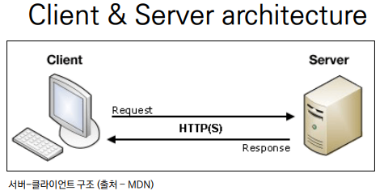

### 💻Variable Routing

- 특정 템플릿이 중복되는 경우 URL 주소를 변수로 지정하여 사용가능하다

- URL의 일부를 변수로 지정하여 view 함수의 인자로 넘기는 것이 가능하다

- 변수의 값에 따라 하나의 path()에 여러 페이지를 연결시킬 수 있다

#### Variable routing 작성

- 변수는 `<>`에 정의하고 view 함수의 인자로 할당

- 기본 타입은 string이고 5가지 타입으로 명시 가능

1. str

2. int

3. slug

4. uuid

5. path

##### View 함수 작성

- variable routing으로 할당된 변수를 인자로 받고 템플릿 변수로 사용 가능

```python
# articles/views.py

def hello(request, name):
    context = {
        'name': name,
    }
    return render(request, 'hello.html', context)
```

```html
<!-- articles/templates/hello.html -->

 
<h1>만나서 반가워요 {{name}}님!</h1>

```

🌟`extends [html_name]`이 템플릿 상속이다. 자세히 알아보자

### 💻Template Inheritance(템플릿 상속)

#### 템플릿 상속

- 코드의 재사용성이 핵심

- 사이트의 모든 공통 요소를 포함하고, 하위 템플릿이 재정의(override) 할 수 있는 블록을 정의하는 기본 'skeleton' 템플릿 생성이 가능

🌟모든 템플릿에 Bootstrap을 적용해보자.

```html
<!-- bootstrap을 적용한 base.html이 있다고 가정할 때, -->

```

``

자식(하위) 템플릿이 부모 템플릿을 확장한다는 것을 알린다

반드시 템플릿 최상단에 작성 되어야 함

``

하위 템플릿에서 재지정(override) 할 수 있는 블록을 정의

가독성을 높이기 위해서 endblock 태그에 이름 지정이 가능

#### 템플릿 상속 예시

1. base.html이라는 skeleton 템플릿 작성

```html
<!-- articles/templates/base.html -->
</html>

<!DOCTYPE html>
<html lang="en">

<head>
    <meta charset="UTF-8" />
    <meta http-equiv="X-UA-Compatible" content="IE=edge" />
    <meta name="viewport" content="width=device-width, initial-scale=1.0" />
    <title>Document</title>
    <!-- bootstrap CDN 작성 -->
</head>

<body>
    
    
    <!-- bootstrap CDN 작성 -->
</body>

</html>
```

2. index 템플릿에서 base 템플릿 상속받음

```html
 
<!-- index 템플릿 만의 데이터 -->
<h1>만나서 반갑습니다.</h1>
<a href="/greeting/">greeting</a>
<a href="/dinner/">dinner</a>

```

### 💻추가 템플릿 경로

- base.html을 앱 안의 template 디렉토리가 아닌 프로젝트 최상단 templates 디렉토리 안에 위치하게 하고 싶으면 경로 추가를 한다

- settings.py 의 TEMPLATE의 DIRS값을 아래와 같이 수정한다.

```python
TEMPLATES = [
    {
        'BACKEND': 'django.template.backends.django.DjangoTemplates',
        'DIRS': [BASE_DIR / 'templates',],
        'APP_DIRS': True,
        'OPTIONS': {
            'context_processors': [
                'django.template.context_processors.debug',
                'django.template.context_processors.request',
                'django.contrib.auth.context_processors.auth',
                'django.contrib.messages.context_processors.messages',
            ],
        },
    },
]
```

- app_name/templates/디렉토리 경로 외 추가 경로를 설정하는 것이다

### 💻Sending and Retrieving form data(데이터 보내고 가져오기)



- 웹은 기본적으로 클라이언트-서버 아키텍쳐를 사용한다.

- 클라이언트가 서버에 요청을 보내고 서버는 클라이언트의 요청에 응답한다.

- HTML form은 HTTP 요청을 서버에 보내는 가장 편리한 방법

### 💻Sending form data(client)

#### HTML `<form>` element

- 데이터가 전송되는 방법 정의

- 웹에서 사용자 정보 입력하는 여러 방식(text, button, submit 등) 제공하며, 사용자로부터 할당된 데이터를 서버로 전송하는 역할 다맏ㅇ

- 핵심 속성: action, method

##### HTML form의 핵심 속성

1. action

- 입력 데이터가 전송될 URL 지정

- 데이터를 어디로 보낼 것인지 지정하는 것이며 반드시 유효한 URL이여야 함

2. method

- 데이터를 "어떻게" 보낼 것인지 정의

- 입력 데이터의 HTTP request methods를 지정

- GET과 POST 방식이 있음

```python
# urls.py
urlpatterns = [
    ...,
    path('throw/', views.throw),
]

# articles/views.py
def throw(request):
    return render(request, 'throw.html')
```

```html
 
<h1>Throw</h1>
<form action="#" method="#"></form>

```

3. name

- form을 통해 데이터를 제출(submit) 했을 때 name 속성에 설정된 값을 서버로 전송하고, 서버는 name 속성에 설정된 값을 통해 사용자가 입력한 데이터 값에 접근이 가능하다.

- 주요 용도는 GET/POST 방식으로 서버에 전달하는 파라미터(name은 key, value는 value)로 매핑하는 것

`URL?key=value&key=value/`

#### HTML `<input>` element 작성

```html
<!-- articles/templates/throw.html -->
 
<h1>Throw</h1>
<form action="#" method="#">
  <label for="message">Throw</label>
  <input type="text" id="message" name="message" />
  <input type="submit" />
</form>

```

#### HTTP request methods

- HTTP: HyperText Transfer Protocol

- HTTP는 주어진 리소스가 수행할 원하는 작업을 나타내는 request methods를 정의

- 자원에 대한 행위(수행하고자 하는 동작)을 정의

HTTP methods 예시: GET, POST, PUT, DELETE

##### GET

- 서버로부터 데이터를 조회하는데 사용(서버로부터 리소스를 요청하기 위해 사용)

- 데이터를 가져올 때 사용

- 데이터를 서버로 전송할 때 Query String Parameters를 통해 전송(데이터는 URL에 포함되어 서버로 보내짐)

🌟GET 메서드 작성

- 명시적 표현을 위해서 대문자를 사용

```html
<!-- throw.html -->

 
<h1>Throw</h1>
<form action="#" method="#">
  <label for="message">Throw</label>
  <input type="text" id="message" name="message" />
  <input type="submit" />
</form>

```
