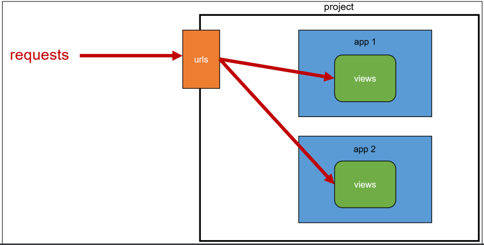
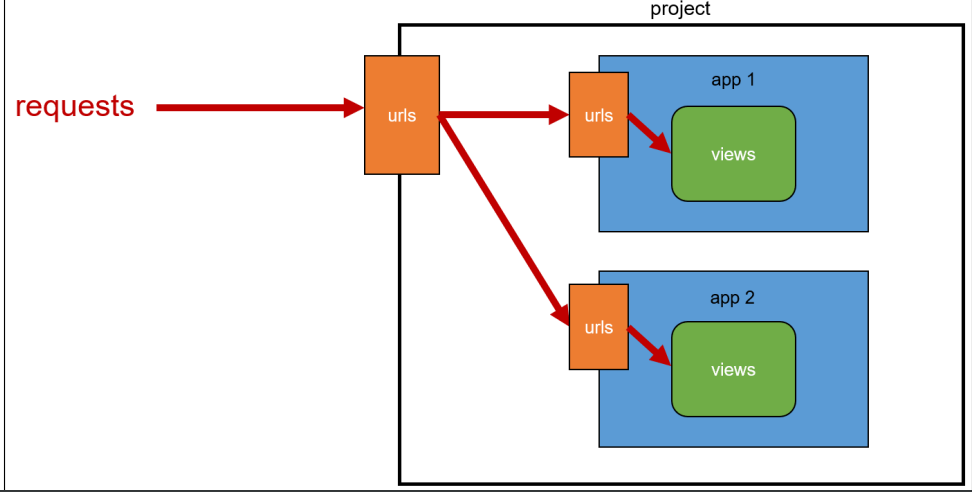

### 💻App URL mapping

- app이 많아질 경우 urls.py를 각 app에 매핑하는 방법

- app의 view 함수가 많아지면서 사용하는 path() 또한 많아지고, app 또한 더 많이 작성되기 때문에 프로젝트의 urls.py에서 모두 관리하는 것을 유지보수에 좋지 않음

⛔예로 app의 하위 path가 많아질수록 이 모든 path를 기록하기가 힘드므로 app폴더 내에 개별적인 urls.py를 생성하여 관리하는 것이다

- 각 앱의 view 함수를 다른 이름으로 import 가능하기는 하다

```python
# project/urls.py

from articles import views as articles_views
from pages import views as pages_views

urlpatterns = [
    ...,
    path('pages-index', pages_views.index),
]
```

- 하나의 프로젝트에 여러 앱 존재 시, 각 앱 안에 urls.py를 만들고 프로젝터 urls.py에서 각 앱의 urls.py 파일로 URL 매핑 위탁이 가능

- 각 app 폴더 안에 urls.py를 작성하고 수정 진행

```python
# articles/urls.py

from django.urls import path
from . import views

urlpatterns = [
    path('index/', views.index),
    path('greeting/', views.greeting),
    path('dinner/', views.dinner),
    path('throw/', views.throw),
    path('catch/', views.catch),
    path('hello/<str:name>/', views.hello),
]

# pages/urls.py

from django.urls import path

urlpatterns = [

]
```

#### Including other URLconfs

> URLconfs는 장고에서 URL과 일치하는 뷰를 찾기 위한 패턴들의 집합

- urlpattern은 다른 URLconf 모듈을 포함(include) 할 수 있다

```python
# firstpjt/urls.py

from django.contrib import admin
from django.urls import path, include

urlpatterns = [
    path('admin/', admin.site.urls),
    path('articles/', include('articles.urls')),
    path('pages/', include('pages.urls')),
]

# app의 하위 path는 개별적으로 각 앱 폴더 내의 urls.py에서 관리한다
```

#### include()

- 다른 URLconf(app1/urls.py)들을 참조할 수 있도록 돕는 함수

### 💻URL 관리 방법

1. 복수 개의 앱의 URL을 project의 urls.py에서 관리

   

2. 각각의 앱에서 URL을 관리

   
