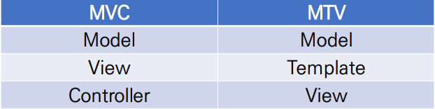
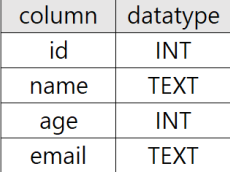
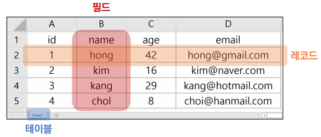
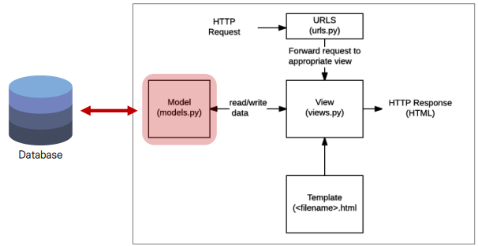
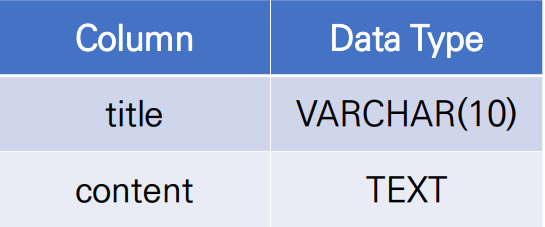
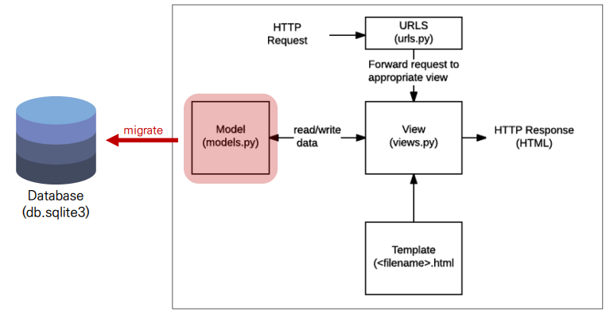
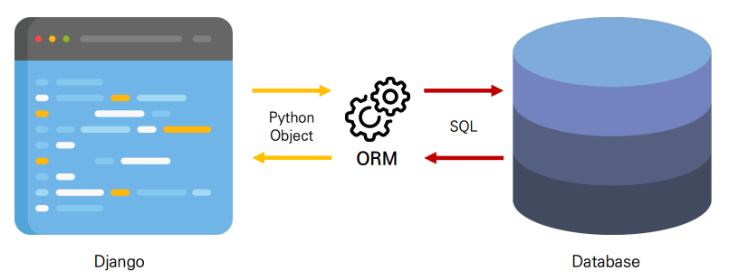
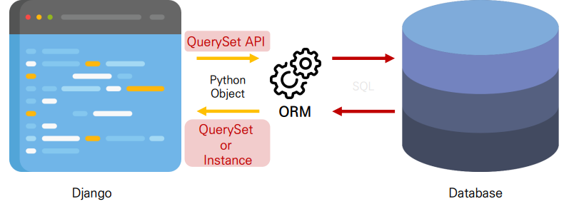

### 💻Namespace

- 개체를 구분할 수 있는 범위를 나타내는 것이 namespace(이름 공간)

```python
# pages/urls.py

from django.urls import path
from . import views

urlpatterns = [
    path('index/', views.index, name='index'),
]

# pages/views.py

def index(request):
    return render(request, 'index.html')
```

```html
<!-- pages/templates/index.html -->

 
<h1>두번 째 앱의 index</h1>


<!-- articles/templates/index.html -->

 
<h1>만나서 반가워요!</h1>
<a href="">greeting</a>
<a href="">dinner</a>
<a herf="">throw</a>

<a href="">두번째 앱 index로 이동</a>

```

⛔pages에서도 같은 index.html가 존재하기 때문에 articles의 index.html로 이동하는 것이 아닌 pages의 index.html로 이동하는 문제가 발생한다.

#### URL namespace

🌟이를 막기 위해서 URL namespace를 활용하여 서로 다른 앱에서 동일한 URL 이름을 이용하는 경우에도 의도한 URL로 이동하게 한다

- app_name attribute를 작성해 URL namespace를 설정

```python
# articles/urls.py

app_name = 'articles'
urlpatterns = [
    ...,
]

# pages/urls.py

app_name = 'pages'
urlpatterns = [
    ...,
]
```

##### 적용 예시

```html
를 로 변경
```

```html
<!-- articles/templates/index.html -->
 
<h1>만나서 반가워요!</h1>
<a href="">greeting</a>
<a href="">dinner</a>
<a href="">throw</a>

<a herf="">두번 째 앱 index로 이동</a>

```

### 💻Template namespace

- 단일 앱으로만 이루어진 프로젝트라면 상관없지만,

- 여러 앱으로 이루어졌을 경우 템플릿 파일 이름이 겹치면 문제가 발생할 수 있기에 구분하는 것이 필요함

#### Naming URL patterns

- DTL의 Tag 중 하나인 URL 태그를 사용해서 path() 함수에 작성한 name 사용

- URL에 이름을 지정하여 view 함수와 템플릿에서 특정 주소 쉽게 참조하도록 함

```python
# articles/urls.py

urlpatterns = [
    path('index/', views.index, name='index'),
    path('greeting/', views.greeting, name='greeting'),
    path('dinner/', views.dinner, name='dinner'),
    path('throw/', views.throw, name='throw'),
    path('catch/', views.catch, name='catch'),
    path('hello/<str:name>/', views.hello, name='hello'),
]
```

#### Built-in tag "url"

``을 사용하는 방법도 있다.

```html
<!-- catch.html -->

 
<h1>Catch</h1>
<h2>여기서 {{ message }}를 받는다.</h2>
<a href="">다시 던지러 돌아감</a>


<!-- throw.html -->

 
<h1>Throw</h1>
<form action="" method="GET">...</form>
<a href="">뒤로 돌아가기</a>


<!-- index.html -->

  ...
<a href="">greeting</a>
<a href="">dinner</a>
<a href="">throw</a>


<!-- dinner.html, greeting.html -->

<a href="">뒤로 돌아가기</a>
```

🍯개발자 도구를 통해 경로 반환 확인이 가능하다

### 💻Django 활용 시

#### Django 설계 철학(Templates System)

1. 표현과 로직(view)을 분리

- 템플릿 시스템은 표현을 제어하는 도구이자 표현에 관련된 로직일 뿐이다

2. 중복 배제

### 💻Django의 구조(MTV Design Pattern)

- MVC 디자인 패턴을 기반으로 변형됨

#### MVC 소프트웨어 디자인 패턴

- Model, View, Controller: 데이터 및 논리 제어를 구현하는데 널리 사용되는 소프트웨어 디자인 패턴

- Model: 데이터와 관련된 로직 관리

- View: 레이아웃과 화면 처리

- Controller: 명령을 model과 view 부분으로 연결

🌟각 부분을 독립적으로 개발이 가능하여 유지보수가 쉽다는 장점이 있다



### 💻Django Model

#### Database

- 체계화된 데이터의 모임

- 검색 및 구조화를 용이하게 하기 위해 조직화된 데이터를 수집하는 저장 시스템

1. Schema



- DB에서 자료의 구조, 표현 방법, 관계 등을 정의

2. Table



- 필드(속성, 컬럼)와 레코드(튜플, 행)를 사용해 조직된 데이터 요소들의 집합

- 관계(Relation)이라고도 부름

##### 🌟Query(쿼리)

- 데이터를 조회하기 위한 명령어

- 조건에 맞는 데이터 추출이나 조작할 때 사용됨(주로 테이블형 자료구조에서)

- "DB를 조작한다" == "쿼리를 날린다"

#### Model



- Django는 Model을 통해 데이터에 접근하고 조작

- 사용하는 데이터들의 필수적인 필드들과 동작을 포함

- 각각의 모델은 하나의 DB 테이블에 매핑(모델 클래스 1개 == DB 테이블 1개)

##### Model 작성

1. 새 프로젝트(crud), 앱(articles) 작성 및 앱 등록

```bash
$ django-admin startproject [project_name] .
$ python manage.py startapp [app_name]
```

```python
# settings.py

INSTALLED_APPS = [
    'articles',
]
```

2. models.py 작성

- 모델 클래스를 작성하는 것은 DB 테이블의 스키마 정의와 같다

```python
# articles([app_name])/models.py

class Article(models.Model): # django.db.models 모듈의 Model 클래스 상속
    # title과 content는 DB필드를 나타냄
    title = models.CharField(max_length=10)
    content = models.TextField()
```

##### Django Model Field

- 모델필드를 통해 테이블의 필드(컬럼)에 저장할 데이터 유형(INT, TEXT 등) 정의

- 데이터 유형에 따라 다양한 모델 필드 제공(DataField(), CharField() 등)

[Model Field References](https://docs.djangoproject.com/en/3.2/ref/models/fields/)

1. `CharField(max_length=None, **options)`

- 길이의 제한이 있는 문자열 넣을 때 사용

2. `TextField(**options)`

- 글자의 수가 많을 때 사용

3. `DateTimeField()`

- datetime.datetime 인스턴스로 표시되는 날짜 및 시간을 값으로 사용하는 필드

- 🌟선택인자

  1. `auto_now_add`

  - 최초 생성 일자

  - 데이터가 "만들어질 때" 현재 날짜와 시간으로 자동으로 초기화

  2. `auto_now`

  - 최종 수정 일자

  - 데이터가 "수정될 때마다" 현재 날짜와 시간으로 자동 갱신

🌟아래와 같이 작성한 models.py는 이러한 DB 스키마를 정의한 것이다

```python
# articles([app_name])/models.py

class Article(models.Model): # django.db.models 모듈의 Model 클래스 상속
    # title과 content는 DB필드를 나타냄
    title = models.CharField(max_length=10)
    content = models.TextField()
```



### 💻Migrations

1. makemigrations

`$ python manage.py makemigrations`

- 모델의 변경사항에 대한 새로운 migration을 만들 때 사용

2. migrate

- makemigrations으로 만든 설계도를 실제 DB에 반영하는 과정(db.sqlite3 파일에 반영)

- 결과적으로 모델의 변경사항과 DB를 동기화

`$ python manage.py migrate`



#### Model 변경사항 반영

- models.py에 변경사항이 생겼을 때 추가 모델 필드 작성 후에 다시 makemigrations 진행

🌟2개의 필드가 추가되는 상황이며 추가되는 컬럼에 대한 기본 값 설정 필요함

```python
# articles/models.py

class Article(models.Model):
    title = models.CharField(max_length=10)
    content = models.TextField()
    # 추가하는 부분(2개의 필드 추가)
    created_at = models.DateTimeField(auto_now_add=True)
    updated_at = models.DateTimeField(auto_now=True)
```

```bash
$ python manage.py makemigrations
```

- makemigrations 후에 설계도(migration 파일)이 생성된 것을 확인 가능

- `$ python manage.py migrate` 통해 DB와 동기화 진행

#### Migration 시 반드시 이 3가지는 기억하자

1. models.py에서 변경사항 발생

2. migration 생성(makemigrations)

3. DB와 동기화(migrate)

⛔이러한 makemigrations으로 만들어진 설계도는 .py파일인데 DB와 동기화를 위해서 필요한 것이 ORM이다.

### 💻ORM

- Object-Relational-Mapping

- 객체 지향 프로그래밍 언어를 사용하여 호환되지 않은 시스템 간에 데이터를 변환하는 프로그램밍 기술

- Django는 내장 Django ORM 사용



#### ORM 장점

- 객체 지향적 접근으로 인한 "높은 생산성"

- SQL 몰라도 DB 조작 가능

#### ORM 단점

- ORM 만으로는 세밀한 DB 조작이 어려움

### 💻QuerySet API

- 외부 라이브러리 설치 등의 사전 준비가 필요하다

```bash
# 파이썬 기본 쉘보다 더욱 강력한 쉘
$ pip install ipython
# Django 확장 프로그램 모음(shell_plus, graph model 등)
$ pip install django-extensions
```

```python
# settings.py
INSTALLED_APPS = [
    'articles',
    'django_extensions',
    ...,
]
```

```bash
$ pip freeze > requirements.txt
```

#### Shell

- 운영체제에서 기능과 서비스 구현이 가능한 인터페이스를 제공하는 프로그램

- 사용자와 운영체제를 이어주는 프로그램이다. (사용자 <=> 쉘 <=> 운영체제)

#### Django Shell

- 일반 python shell로는 장고 내에 영향을 줄 수 없기에 Django shell 사용

- 실습에서는 더 강력한 django-extension의 shell_plus 사용

```bash
$ python manage.py shell_plus
```

#### Database API

- Django ORM을 활용하여 DB를 조작하는 방법

- Model 정의 시 데이터 CRUD가 가능한 APi를 제공

```python
# Article = Model class
# objects = Manager
# all() = Queryset API
Article.objects.all()
```

##### Objects Manager

- Django 모델이 DB 쿼리 작업을 가능하게 하는 인터페이스

- Django 모델 클래스에 objects라는 Manager 객체를 자동으로 추가하고 이를 통해 데이터 조작이 가능

- 즉 DB를 python class로 조작할 수 있도록 여러 메서드 제공하는 manager

##### Query

- DB에 특정한 데이터를 보여달라는 요청(쿼리를 날린다, 쿼리문을 작성한다: 원하는 데이터 얻기 위해 DB에 요청을 보낼 코드를 작성한다)

1. 파이썬으로 코드 작성

2. ORM으로 SQl로 변환되어 DB에 전달, DB의 응답 데이터를 QuerySet이라는 자료형태로 변환하여 사용자에게 제공

##### QuerySet

- DB에게서 전달받은 객체 목록(데이터)

- Django ORM을 통해 만들어진 자료형이며 필터나 정렬 수행 가능

- DB가 단일된 데이터를 반환할 때는 QuerySet이 아닌 모델(Class)의 인스턴스로 반환됨



### 💻QuerySet API CRUD

- 컴퓨터 연산의 기본 데이터 처리 기능 4가지(Create, Read, Update, Delete)

#### Create

1. `article = Article()`: 클래스를 통한 인스턴스 생성

2. `article.title`: 클래스 변수명의 인스턴스 변수 생성 후 할당

3. `article.save()`: 인스턴스로 save 메서드 호출
