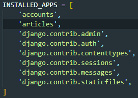
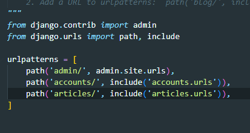
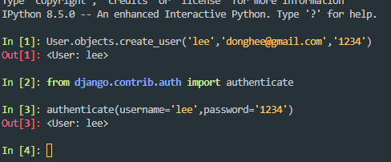

### 💻Django Auth

회원가입/로그인의 필수 및 요구조건이 무엇일까?

`Django authentication system`: 인증과 권한 부여를 제공(처리)함

- 필수 구성은 settings.py의 INSTALLED_APPS에서 확인 가능


#### Django Auth 개요

- Authentication(인증): 신원확인, 누군지 확인하는 것

- Authorization(권한, 허가): 권한 부여, 권한 가진 이용자가 수행가능한 작업을 결정


##### 사전설정

1. 사용자 정보를 관리하는 accounts / 게시글을 관리하는 articles 생성 및 등록

```bash
# 실습/django_project
$ python manage.py startapp accounts
$ python manage.py startapp articles
```

앱 생성 후에 INSTALLED_APPS에 추가해주자.




2. project 폴더의 urls.py에 accounts와 articles, 각각 앱의 경로를 추가해줌(url 분리 및 매핑을 진행한다)




#### Django User Model

- 새 프로젝트 시작 시 커스텀 User 모델 설정하는 것을 강력하게 권장

- 나중에 필요한 경우 맞춤 설정할 수 있기 때문(예: 성별 추가, 새로운 컬럼 추가 시)

- 모든 model 대체 작업은 migrate 실행 전에 마쳐야 함


##### AUTH_USER_MODEL

커스텀 유저 모델을 작성해보자.

모델은 내부 모델을 상속받아서 활용한다.

1. settings.py에 모델 정의
```python
# project/settings.py
AUTH_USER_MODEL = 'accounts.User'
```

2. User class 정의
```python
# app/models.py
from django.db import models
from django.contrib.auth.models import AbstractUser

# Create your models here
class User(AbstractUser):
    pass
```


##### DB초기화 시

1. migrations파일 삭제

- migrations폴더 및 __init__.py는 X삭제

- 번호 붙은 파일만 삭제

2. db.sqlite3 삭제

3. migrations 진행

- makemigrations 및 migrate 진행


#### Article에서 유저 게시물 생성

- django shell_plus 내에서 실행

```python
In [1]: Article.objects.create(title='제목1', content='내용1')
Out[1]: <Article: Article object (1)>
# 이렇게 저장하면 그대로 저장되기 때문에 보안에 문제가 생긴다! 반드시 암호화를 해야함
In [2]: User.objects.create(username='sun', content='1q2w3e4r')
Out[2]: <Article: Article object (2)>
```

⛔User는 반드시 암호화하는 로직을 사용해야하기 때문에 create를 사용하면 안된다!


##### 암호관리

1. 단방향 해시함수

- Django에서 기본적으로 PBKDF2(Password-Based Key Derivation Function) 사용해야함

    - 암호화가 필수임(단방향 해시함수 활용하여 다이제스트로 암호화, 복호화가 불가능)

    단방향 해시함수 예: SHA-1, SHA-256등이 존재하며 Django는 SHA-256활용

##### ⛔단방향 해시함수의 약점: 

    1. 레인보우 테이블: 해시 함수를 사용해서 만들어 낼 수 있는 값을 테이블로 정리하여 해킹에 활용

    2. 브루트포스: 무차별 대입 

##### 🌟해킹 대처법:

    솔팅(레인보우 테이블 해킹): input 값 자체에 추가적인 값을 입력하여 해킹을 방지

    keystretching(브루트 포스): 알고리즘을 N회 돌려서 input에 반영 브루트포스 활용하여 해킹하는 데에 걸리는 시간을 비약적으로 늘림

#### User 객체 활용하여 유저 정보 생성 및 저장

1. `User.objects.create_user`로 유저 정보를 입력하여 유저를 생성한다.

2. `from django.contrib.auth import authenticate`로 authenticate 기능을 import

3. `authenticate(username='[name]',password='[password]')`가 일치하면 User정보를 반환해주고 그렇지 않으면 아무것도 반환하지 않는다.




### 💻회원가입 구현(실습)

1. accounts/urls.py에 회원가입 기능 정의

```python
# accounts/urls.py
from django.urls import path
from . import views

app_name = 'accounts'

urlpatterns = [
    path('signup/', views.signup, name='signup'),
]
```

2. accounts/views.py에 view 함수 정의(accounts/templates/accounts/signup.html생성)

```python

```


```python
# appname/urls.py
from django import path

```

```python
# appname/views.py
from django.shortcuts import render

def signup(request):
    return render(request, 'accounts/signup.html')
```

```python
# appname/templates/appname/signup.html


<회원가입>
{{form.as _p}}

```

```python
from django.shortcuts import render
from django.contrib.auth.forms import UserCreationForm

def signup(request):
    # POST 요청 처리
    if request.method == 'POST':
        form = UserCreationForm(request.POST)
        if form.is_valid():
            form.save()
            return redirect('articles.index')

    else:
        form = userCreationForm()
        context = {
            'form': form
            }
    return render(request, 'accounts/signup.html', context)
```