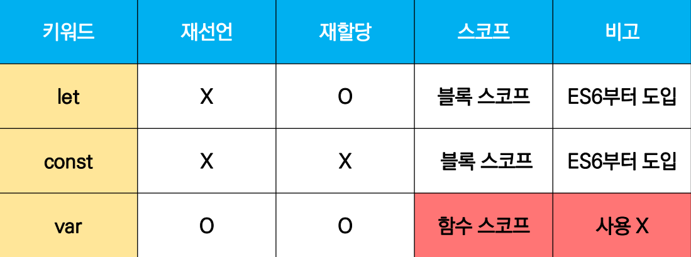
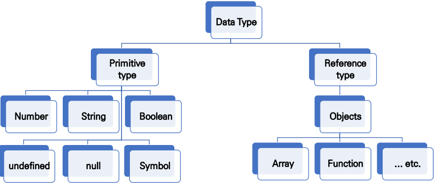
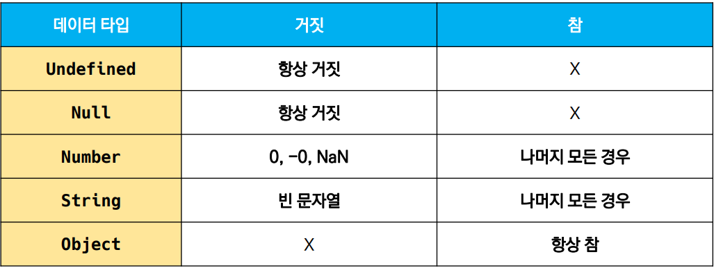
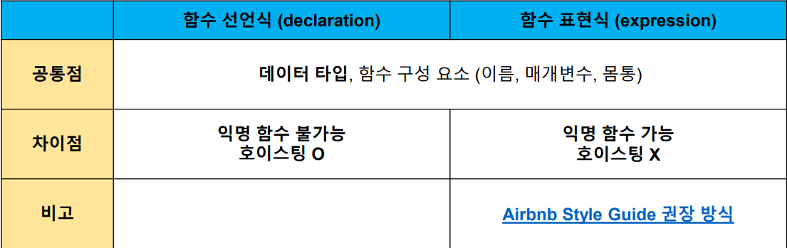

### 💻ECMA Script

#### 변수와 식별자

- 식별자는 변수를 구분할 수 있는 변수명을 뜻함

- 식별자로 예약어 사용이 불가능

- 식별자는 반드시 문자, 달러($), 밑줄(\_)로 시작

#### 🌟변수는 선언, 할당, 초기화를 통해 조작/생성한다.

- 선언(Delcaration): 변수를 생성하는 행위

- 할당(Assignment): 선언된 변수에 값을 저장하는 행위

- 초기화(Initialization): 선언된 변수에 "처음으로" 값을 저장하는 행위

```javascript
// Declaration
const foo
console.log(foo) // undefined

// Assignment
foo = 11
console.log(foo) // 11

// Initialiation
let bar = 12
console.log(bar) // 12
```

<br>

#### let과 const의 차이

둘다 재선언(Declaration)은 불가능하지만

`let`은 재할당이 가능하다.

`const`는 재할당이 불가능하다.

즉 추후 변경 가능성이 있는 변수는 `let`으로 생성하고

변경 가능성이 없는 변수는 `const`로 생성한다.

```javascript
let a = 11;
a = 12;
console.log(a); // 12

const b = 99;
b = 100; // 불가능
```

⛔둘다 재선언은 불가능하다.

```javascript
let a = 100;
let a = 101; // 불가능

const b = 100;
const b = 101; // 불가능
```

<br>

#### var

var로 선언한 변수는 재선언 및 재할당이 모두 가능하다.

그래서 현재 ES에서는 잘 사용되지 않는다.

실수로 재선언시 문제가 발생할 수 있다.

```javascript
var num = 100;
console.log(num); // 100

var num = 200;
console.log(num); // 200
```

⛔var로 선언한 변수는 hoising(호이스팅) 문제를 야기할 수 있다

<br>

#### hoisting

자바스크립트에서는 코드 실행 전에 모든 선언을 스코프에 등록하는 과정을 거친다.

이렇게 변수선언/함수선언이 먼저 저장되어 있기 때문에, 선언문보다 참조/호출이 먼저 나와도 코드가 오류없이 작동된다.

즉 hoisting이란,

> 이 호이스팅이라는 용어를 자바스크립트 실행 컨텍스트에 의한 위에 설명한 현상을 호이스팅이라고 부른다는 것으로 이해하면 되겠다. 그 현상이란 선언이 코드 실행 보다 먼저 메모리에 저장되는 과정으로 인한 현상을 말한다.

출처: [호이스팅이란](https://hanamon.kr/javascript-%ED%98%B8%EC%9D%B4%EC%8A%A4%ED%8C%85%EC%9D%B4%EB%9E%80-hoisting/)

<br>

#### Let vs Const vs Var



<br>

##### 블록스코프 vs 함수스코프

블록스코프: if, for, 함수 등의 중괄호 내부를 가르킨다.

함수스코프: 함수의 중괄호 내부를 가르킨다.

블록스코프 / 함수스코프를 가지는 변수는 모두 함수 바깥에서 접근이 불가능하다.

```javascript
// 블록스코프
let x = 1;
if (x === 1) {
  let x = 2;
  console.log(x); // 2
}
console.log(x); // 1

// 함수스코프
function foo() {
  var x = 5;
  console.log(x); // 5
}
console.log(x); // ReferenceError: x is not defined
```

<br>

### 💻데이터 타입

원시타입(Primitive type)과 참조타입(Reference type)으로 나뉨

🌟객체이냐 객체가 아니냐로 구분이 가능하다.



<br>

#### Primitive Type(원시타입)

- 객체가 아닌 기본 타입

- 변수에 해당 타입의 값이 담김

- 다른 변수에 복사할 때 실제 값이 복사됨

```javascript
let message = "hello!";

let greeting = message;
console.log(greeting); // hello!

message = "안녕하세요!";
console.log(greeting); // hello!
```

<br>

#### Reference Type(참조타입)

- 객체 타입의 자료형

- 변수에 해당 객체의 참조 값이 담김

- 다른 변수에 복사할 때 참조 값이 복사됨

```javascript
const message = ["hello!"]; // Array

const greeting = message;
console.log(greeting); // ['hello!']

message[0] = "안녕하세요!";
console.log(greeing); // ['안녕하세요!]
```

<br>

#### Number(숫자타입)

- 정수, 실수 구분없음(하나의 숫자타입)

- 부동소수점 형식을 따름

##### 🌟NaN(Not a Number): 계산 불가능한 값이다.

    예: 'Javascript' / 3.14 == NaN

```javascript
const a = 13;
const b = -5;
const c = 3.14;
const d = 2.998e8; // 거듭제곱
const e = Infinity; // 양의 무한대
const f = -Infinity; // 음의 무한대
const g = NaN; // 산술 연산 불가
```

<br>

#### String(문자열타입)

- 텍스트 데이터를 나타냄

- 템플릿 리터럴(Template Literal) 활용

  - 따옴표 대신 백틱(`)을 사용한다.

  - `${expression}` 형태로 표현이 가능하다.

  - 🍯파이썬의 f-string이라고 생각하면 된다.

  ```javascript
  const firstName = "Brandon";
  const lastName = "Eich";
  const fullName = `${firstName} ${lastName}`;

  console.log(fullName); // Brandon Eich
  ```

<br>

#### Undefined

- 변수 선언 이후 값을 할당하지 않으면 해당 변수에는 undefined가 할당된다.

- 변수의 값이 없음을 나타냄

```javascript
let foo;
console.log(foo); // undefined
```

<br>

#### Null

- 변수의 값이 없음을 "의도적으로" 표현할 때 사용

##### 🌟참고: null 타입과 typeof 연산자

typeof 연산자: 자료형 평가를 위한 연산자

```javascript
let firstName = null;
console.log(firstName); //null

typeof null; // object
```

⛔null 타입은 [ECMA 명세의 원시 타입의 정의](https://tc39.es/ecma262/#sec-primitive-value)에 따라 원시 타입에 속하지만,

`typeof null` 시 결과는 객체(object)로 표시되는 특성을 지닌다.

<br>

#### Boolean

- 논리적 참 / 거짓 나타내는 자료형

- true or false 로 표현

```javascript
let isAdmin = true;
console.log(isAdmin); // true

isAdmin = false;
console.log(isAdmin); // false
```



<br>

### 💻연산자

#### 할당 연산자

- Increment(증감연산자): `++`

- Decrement(감소연산자): `--`

```javascript
let x = 0;

x += 10;
console.log(x); // 10

x -= 3;
console.log(x); // 7

x *= 10;
console.log(x); // 70

x /= 7;
console.log(x); // 10

x++;
console.log(x); // 11

x--;
console.log(x); // 10
```

<br>

#### 비교연산자

- 피연산자를 비교하고 결과를 boolean으로 반환하는 연산자

- 문자열은 유니코드 값을 사용하며 사전 순서 기반하여 비교

  - 예: 알파벳 후순위가 더 크다 / 소문자가 대문자보다 더 크다

```javascript
const num1 = 1;
const num2 = 100;
console.log(num1 < num2); // true

const char1 = "a";
const char2 = "A";
console.log(char1 < char2); // false
```

<br>

#### 동등비교 연산자(`==`), 일치비교 연산자(`===`)

- 두 연산자 모두 값이 동등한지 체크하는데 사용됨

- 일치비교 연산자에서 더욱 엄격한 비교가 이뤄진다.

- `동등비교 연산자`: 암묵적 타입 변환을 통해 타입을 일치시킨 후, 같은 값인지 비교

  - ⛔동등비교 연산자는 예상치 못한 결과가 발생가능

```javascript
const a = 1004;
const b = "1004";
console.log(a == b); // true

const c = true;
const d = 1;
console.log(c == d); // true
```

- `일치비교 연산자`: 타입부터 값까지 모두 완전하게 일치하는지 체크

```javascript
const a = 1004;
const b = "1004";
console.log(a === b); // false

const c = true;
const d = 1;
console.log(c === d); // false
```

<br>

#### 논리연산자

- `&&`: and 연산

- `||`: or 연산

- `!`: not 연산

<br>

#### 삼항연산자(Ternary Operator)

- 세 개의 피연산자를 활용하여 조건에 따른 결과를 반환

- 기본형식

```javascript
console.log(condition ? case1 : case2);
```

조건식(condition)이 참이면 case1을, 거짓이면 case2를 반환한다.

```javascript
console.log(true ? 1 : 2); // 1
console.log(false ? 1 : 2); // 2

const result = Math.PI > 4 ? "YES" : "NO";
console.log(result); // NO
```

<br>

### 💻조건문

#### if / switch / else if, else

- `if`: 조건식의 결과값을 Boolean으로 변환 후 참/거짓을 판단

- `switch`: 조건 표현식이 여러개의 case중 어떤 case에 해당하는지 판단

  - break문을 만나거나 default 실행 전까지 다음 조건문 실행

Switch 예시

```javascript
switch(expression){
  case 'first case': {
    // do something
    [break]
  }
  clase 'second case': {
    // do something
    [break]
  }
  [default: {
    // do something
  }]
}
```

<br>

### 💻반복문

- while

```javascript
let i = 0;
while (i < 100) {
  console.log(i);
  i++;
}
```

- for

  - 세미콜론(`;`)으로 나뉘어 세 부분으로 구성됨

  - initialization: 최초 반복문 진입 시 한번만 실행

  - condition: 매 반복 시행 전 평가되는 부분

  - expression: 매 반복 이후 평가되는 부분

  ```javascript
  // i가 5가 되기 전까지 계속 +1
  for (i = 0; i < 5; i++) {
    console.log(i);
  }
  ```

- for ... in

  - 객체의 `key`를 순회할 때 사용함

  - 배열도 가능하나 권장되지 않음

  ```javascript
  const capitals = {
    korea: "seoul",
    france: "paris",
    usa: "washington dc",
  };

  for (let country in capitals) {
    console.log(capital); // korea, france, usa
  }
  ```

- for ... of

  - 반복 가능(iterable)한 객체를 순회하며 값을 꺼낼 때 사용

  - 파이썬의 `for i in iterable`과 같다고 생각하면 된다

  ```javascript
  const fruits = ["apple", "banana", "kiwi"];
  for (let fruit of fruits) {
    console.log(fruit); // apple, banana, kiwi
  }
  ```

##### 🌟`for ... in`은 객체 순회에 적합하고 `for ... of`은 배열 순회에 적합

<br>

### 💻함수

자바스크립트에서의 함수 정의 방법은 2가지

- 함수 선언식(function declaration)

- 함수 표현식(function expression)

<br>

🌟함수의 예시

함수는

- 이름(name)

- 매개변수(args)

- 함수 body(중괄호 내부)

로 구성된다

```javascript
function name(args) {
  // do something
}

function add(num1, num2) {
  return num1 + num2;
}

add(1, 2);
```

<br>

#### 함수 표현식(function expression)

- 함수를 하나의 변수로 정의하는 행위

- 함수의 이름을 생략하고 익명 함수로 정의도 가능하다

##### 기본인자(Default arguments)

- 함수의 기본 매개변수를 설정

```javascript
const greeting = function (name = "Anonymous") {
  return `Hi, ${name}`;
};

greeting();
```

⛔자바스크립트에서는 파이썬과는 다르게 매개변수와 인자 갯수 불일치가 허용된다

```javascript
const threeArgs = function (args1, args2, args3) {
  return [args1, args2, args3];
};

threeArgs(); // [undefined, undefined, undefined]
threeArgs(1); // [1, undefined, undefined]
threeArgs(1, 2); // [1, 2, undefined]
```

<br>

##### Rest Parameter

- 정해지지 않은 수의 매개변수를 배열로 받음

  - 만약에 정해진 매개변수에 인자가 넘어지지 않을 경우 빈 배열로 처리

- 파이썬의 `function(*args)`과 유사하다

```javascript
const restArgs = function (args1, args2, ...restArgs) {
  return [args1, args2, restArgs];
};

restArgs(1, 2, 3, 4, 5); // [1,2,[3,4,5]]
restArgs(1, 2); // [1,2,[]]
```

<br>

##### Spread operator

- 사용하면 배열 인자 전개하여 전달 가능

```javascript
SpreadOpr = function (args1, args2, args3) {
  return args1 + args2 + args3;
};

const numbers = [1, 2, 3];
SpreadOpr(...numbers); // 6
```

<br>

### 💻선언식 vs 표현식 정리



<br>

#### 함수 선언식에서의 호이스팅(hoisting)

- 함수 선언식으로 선언한 함수는 hoisting 발생

- 함수 호출 이후에 선언해도 동작함

```javascript
add(2, 4); // 6

function add(args1, args2) {
  return args1 + args2;
}
```

<br>

#### 함수 표현식에서의 호이스팅(hoisting)

- 함수 표현식으로 선언한 함수는 hoisting 적용 안됨

- 변수로 평가되어 변수의 scope 기준을 따르기 때문이다

```javascript
sub(7, 2); // Uncaught ReferenceError

const sub = function (args1, args2) {
  return args1 - args2;
};
```

<br>

### 💻Arrow Function

- 함수를 비교적 간단하게 정의 가능

- function 키워드 생략 가능

- 매개변수가 하나 뿐이라면 `()`도 생략 가능

- 함수 body가 하나 뿐이라면 `{}`과 return도 생략 가능

```javascript
const arrow1 = function (name) {
  return `hello ${name}`;
};

// 1. function 키워드 삭제 가능
const arrow2 = (name) => {
  return `hello ${name}`;
};

// 2. 매개변수가 1개일 경우 () 삭제 가능
const arrow3 = `name` => {
  return `hello ${name}`;
};

// 3. body가 1개일 경우 {}과 return 삭제 가능
const arrow4 = `name` => `hello, ${name}`;
```

<br>

### 💻문자열

- string.includes(value)

  - 문자열에 value가 존재하는지 참, 거짓으로 판별

  ```javascript
  const str = "I love chicken";
  str.includes(chicken); // true
  ```

<br>

- string.split(value)

  - 파이썬과 다르게 value가 없을 경우 그대로 반환

  - 빈 문자열일 경우 글자 하나하나 반환

  - 기타 문자열일 경우 해당 문자열 기준으로 나눈것을 반환

  ```javascript
  const str = "I love chicken";
  str.split(); // ['I love chicken']
  str.split(""); // ['I', ' ', 'l', 'o', 'v', 'e' ...]
  str.split(" "); // ['I', 'love', 'chicken']
  ```

<br>

- string.replace(from, to) / string.replaceAll(from, to)

  - 문자열을 교체

  ```javascript
  const str = "fried chicken is the best chicken";
  str.replace(chicken, fish); // fried fish is the best chicken
  str.replaceAll(chicken, fish); // fried fish is the best fish
  ```

<br>

- trim

  - 공백 제거

  - string.trim(): 문자열의 시작과 끝의 모든 공백문자 제거

  - string.trimStart(): 문자열 시작의 공백문자 제거

  - string.trimEnd(): 문자열 끝의 공백문자 제거

  ```javascript
  const str = "  string  ";
  str.trim(); // 'string'
  str.trimStart(); // 'string  '
  str.trimEnd(); // '  string'
  ```

<br>

### 💻배열(Array)
