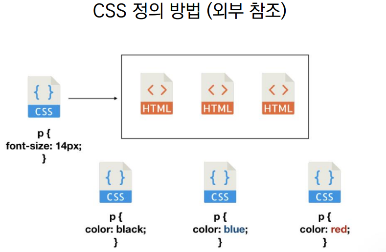

### 💻웹(Web) 개요

- 웹 사이트는 브라우저를 통해 동작한다.

- 웹에 접속하기 위해서 웹 브라우저를 사용하는데, 이 때 브라우저마다 동작이 약간씩 달라서 문제가 생기는 경우가 많다.

- 같은 코드로 작성된 웹페이지, 웹앱임에도 불구하고 브라우저에 따라 동작결과나 화면이 상이하게 되는데, 이를 `파편화`라고 한다.

- 이에 대한 해결책으로 `웹 표준`이 등장하였다!

<br>

### 💻웹 표준

- 웹에서 표준적으로 사용되는 기술이나 규칙

- 어떤 브라우저든 웹 페이지가 동일하게 보이도록 함(크로스 브라우징)

> 크로스 브라우징: 최대한 많은 종류의 웹 브라우저에서 정상적으로 작동하게 하기 위해서 사용되는 기술이다. 이를 위해서 W3C(World Wide Web Consortium)에서 채택된 웹표준 기술을 기본으로 웹을 제작한다.

- 과거에는 웹 표준이 존재하지 않았기 때문에 지금과 같은 웹 개발이 불가능했다.

🍯현재 HTML 및 관련 기술을 발전시키기 위한 모임이 존재하는데 이를

`WHATWG(Web Hypertext Application Technology Working Group: 웹 하이퍼텍스트 애플리케이션 테크놀로지 워킹 그룹)`

이라고 칭한다. 현재 참여하는 핵심 기업 및 단체로는 Apple, Google, Microsoft, Mozilla가 있다.

<br>

### 💻HTML이란?

Hyper Text Markup Language는

> 참조(하이퍼링크)를 통해 사용자가 한 문서에서 다른 문서로 즉시 접근할 수 있는 텍스트

❗위키백과같은 웹사이트를 접속할 하여 검색 후에 글을 읽다보면 다른 링크로 연결되는 문장, 단어가 있는데 이를 `하이퍼링크`라고 한다!

🍯HTML은 Markup(마크업) 언어이다!

> 태그 등을 이용하여 문서나 데이터의 구조를 명시하는 언어

- 마크업 언어로는 이전에 배웠던 마크다운이 있다!

- HTML은 마크다운 언어와는 다르게 `태그, <>` 를 활용하여 문단의 구조를 정의한다.

<br>

### 💻HTML의 기본 기초

- `html`: 문서의 최상위(root) 요소

- `head`: 문서 메타데이터 요소

  - 문서 제목, 인코딩, 스타일, 외부 파일 로딩 등

  - 메타데이터는 일반적으로 브라우저에 나타나지 않는 내용을 다룬다.

  ⛔메타 데이터란 데이터를 위한 데이터다. 즉 데이터를 설명하는 데이터이다!

  ⛔예로 사진 데이터가 있을 때 사진에는 우리가 보는 시각적인 이미지 뿐만 아니라, `파일의 크기, 해상도 등의 여러 데이터`가 존재한다. 이러한 데이터가 바로 사진 데이터를 설명하는 `메타 데이터`이다!

- `body`: 문서 본문 요소. 실제 화면 구성과 관련된 내용

<br>

### 💻head

- `<meta>`: 문서 레벨 메타데이터 요소

- `<title>`: 브라우저 상단 타이틀

- `<link>`: 외부 리소스 연결 요소 (CSS 파일, favicon 등)

  > favicon: 파비콘 또는 패비콘이란 웹 브라우저의 주소창에 표시되는 웹사이트나 웹사이트를 대표하는 아이콘이다.

- `<script>`: 스크립트 요소 (Javascript 파일/코드)

- `<style>`: CSS 직접 작성

head HTML 코드 예시

```html
<head>
  <title>HTML 수업</title>
  <meta charset="UTF-8" />
  <link href="style.css" rel="stylesheet" />
  <script src="javascript.js"></script>
  <style>
    p {
      color: black;
    }
  </style>
</head>
```

HTML 전체 구조 예시

```html
<!DOCTYPE html>
<html>
  <head>
    <!--본 문서의 제목은 HTML 기초이다 -->
    <title>HTML 기초</title>
  </head>
  <body></body>
</html>
```

<br>

### 💻elements

`<h1>contents</h1>`

- 요소는 여는 태그(`<tag>`)와 닫는 태그(`</tag>`)로 구성된다.

- 하지만 `내용이 없는 태그들도 존재`한다(닫는 태그가 없음)

  - br, hr, img, input, link, meta 등

- 요소는 중첩(nested) 될 수 있다.

- 기본적으로 html태그 내에 head와 body가 존재한다. 이 때 html 태그 내에 존재하는 head와 body 태그를 `중첩`이라고 표현한다.

<br>

### 💻attribute

`<a href="https://google.com"></a>`

⛔`href`가 속성명이고 `https://google.com`이 속성값이다.

⛔`=` 기호 사이에 공백은 없어야하며 쌍따옴표를 사용한다.

- 속성을 통해 태그의 부가적인 정보를 설정할 수 있다.

- 앞서 설명했던 요소(element)는 속성을 가질 수 있으며, 경로나 크기 같은 추가적인 정보를 제공한다.

- 요소의 시작 태그에 작성하며 보통 이름과 값이 하나의 쌍으로 존재한다.

- 태그와 상관없이 사용 가능한 속성들을 `Global Attribute`라고 한다.

🍯대표적인 Global Attribute:

- `id`: 문서 전체에서 유일한 고유 식별자 지정

- `class`: 공백으로 구분된 해당 요소의 클래스의 목록 (CSS, JS에서 요소를 선택하거나 접근)

- `style`: inline 스타일

- `title`: 요소에 대한 추가 정보 지정

<br>

### 💻Rendering(렌더링)

텍스트로 작성된 코드가 어떻게 웹 사이트가 되기 위해서는 `렌더링` 과정을 거친다.

> 웹사이트 코드를 사용자가 보기에 웹사이트로 볼 수 있게 바꾸는 과정

<br>

### 💻DOM(Document Object Model) 트리

- 텍스트 파일인 HTML 문서를 브라우저에서 렌더링 하기 위한 구조

  - HTML 문서에 대한 모델을 구성함

  - HTML 문서 내의 각 요소에 접근 / 수정에 필요한 프로퍼티와 메서드를 제공함

- 쉽게 말해서 부모와 자식 태그를 설명하는 트리이다.


<br>

### 💻인라인/블록 요소

- HTML요소는 크게 인라인 / 블록 요소로 나뉜다.

- 인라인 요소는 글자처럼 취급하고 블록 요소는 한 줄을 모두 사용한다.

<br>

### 💻텍스트 요소


<br>

### 💻그룹 컨텐츠


```html
<!-- a 태그: 하이퍼링크 -->
<a href="https://google.com">구글</a>

<!-- br 태그: 텍스트 내에 줄바꿈 생성 (줄바꿈 네번)-->
<br /><br /><br /><br />

<!-- &nbsp; : 띄어쓰기 -->
&nbsp;

<b>굵은글씨</b>

<strong>중요한 강조하고자 하는 요소(보통 굵은 글씨로 표현)</strong>

<i>이탤릭체</i>

<em>중요한 강조하고자 하는 요소(보통 기울임 글씨로 표현)</em>


<p>문단 문단</p>

<!-- 주제의 분리 -->
<hr />

<!-- ordered list -->
<ol>
  <li>순서가 있음</li>
</ol>

<!-- unordered list -->
<ul>
  <li>순서가없음</li>
</ul>

<p>엔터는 먹히지 않는 paragraph</p>

<blockquote>들여쓰기, 인용문 활용 시 사용</blockquote>

<pre>
    엔터도 먹힌다!!
</pre>
```

<br>

### 💻CSS

Cascading Style Sheet

> "위에서 아래로 흐르며 스타일을 입혀주는 Sheet"

- HTML이 웹사이트의 구조를 이루는 뼈대라면, CSS는 뼈대에 생동감을 주기 위해서 살을 붙이는 것이다.

- 스타일을 지정하기 위한 언어. 선택하고 스타일을 지정한다.

- CSS 구문은 선택자를 통해 스타일을 지정할 HTML요소를 선택 가능하다.

- 중괄호 안에서는 속성과 값, 하나의 쌍으로 이루어진 선언을 진행한다.

- 각 쌍은 선택한 요소의 속성, 속성에 부여할 값을 의미한다.

  - 속성(Property): 어떤 스타일 기능을 변경할지 (font-size, color)

  - 값(Value): 어떻게 스타일 기능을 변경할지 (15px, red)

기본 구문

```css
/* 컬러는 파란색이고 폰트크기는 15픽셀이다. */
/* h1은 선택자(Selector)이다. */
h1 {
  color: blue; /*선언(Declaration)*/
  font-size: 15px; /* font-size: 속성, 15px: 값 */
}
```

아래와 같이 style을 class id로 지정하여 변경할 수 있다.

```html
<!-- 다만 이렇게 h3에 스타일을 지정해줘도 색깔은 brown이다. -->
<!-- 우선순위가 class, id, tag 이기 때문이다. -->
<style>
  /* class */
  .title-brown {
    color: brown;
  }
  /* tag */
  h3 {
    color: red;
  }
  /* id */
  #title-yellow {
    color: yellow;
  }
</style>

<h3 class="title-brown">text</h3>
<h4 id="title-yellow">text</h4>
```

<br>

### 💻CSS의 우선순위

1. class

2. id

3. tag

<br>

### 💻CSS 정의방법

1. 인라인: HTML태그에 직접 style속성을 입력하여 사용하는 것이다.

```html
<h1 style="color: blue; font-size: 100px;">Hello</h1>
```

2. 내부 참조: `<head>` 태그 내에 `<style>`에 지정하는 것이다.

```html
<style>
  h1 {
    color: blue;
    font-size: 100px;
  }
</style>
```


3. 외부 참조: 외부 CSS 파일을 `<head>` 내의 `<link>`를 통해 불러오는 것이다.

```html
<link rel="stylesheet" href="mystyle.css" />
```



<br>

### 💻CSS 기초 선택자

1. 요소 선택자

   - HTML 태그를 직접 선택

2. 클래스 선택자

   - 마침표(`.`) 문자로 시작하며 해당 클래스가 적용된 항목을 선택

   - 일반적으로 CSS 스타일링은 클래스 선택자로만 한다.

3. 아이디 선택자

   - `#` 문자로 시작하며, 해당 아이디가 적용된 항목을 선택

   - 아이디는 일반적으로 하나의 문서에 1번만 사용

   - 어러 번 사용해도 동작하지만, 단일 id를 사용하는 것을 권장
