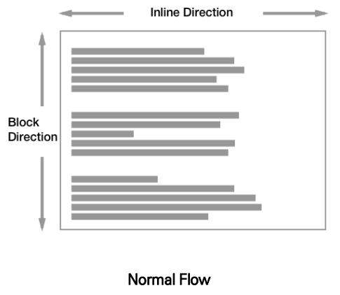
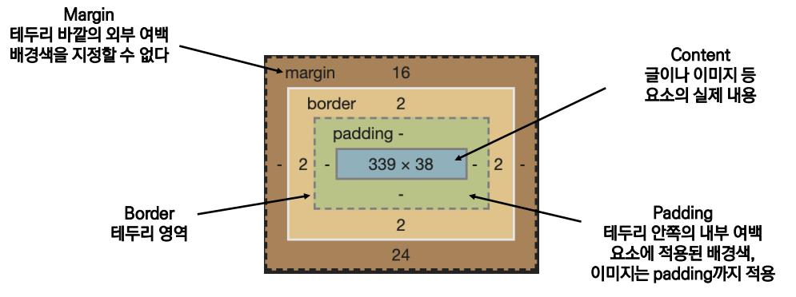

### 💻html 복습

```html
<!DOCTYPE html>
<html lang="en">
  <head>
    <meta charset="UTF-8" />
    <meta http-equiv="X-UA-Compatible" content="IE=edge" />
    <meta name="viewport" content="width=device-width, initial-scale=1.0" />
    <title>Document</title>
  </head>
  <body></body>
</html>
```

떡볶이 집 / 김밥 리스트를 만들어보자. 리스트를 만든고 CSS를 활용하여 꾸며보자.

```html
<!DOCTYPE html>
<html lang="en">
  <head>
    <meta charset="UTF-8" />
    <meta http-equiv="X-UA-Compatible" content="IE=edge" />
    <meta name="viewport" content="width=device-width, initial-scale=1.0" />
    <title>Document</title>
    <style>
      #kimbap {
        color: red;
      }
      .blue {
        color: blue;
      }
      .green {
        color: green;
      }
    </style>
  </head>
  <body>
    <ul>
      <li>삼첩분식</li>
      <li>또보겠지</li>
      <li>엽떡</li>
      <li>죠떡</li>
      <li>배떡</li>
    </ul>

    <!-- h2#kimbap+ul>li.blue*5 -->
    <!-- 내가 만약 어떤 부분을 CSS 적용하고 싶다면, 반드시 마크업을 해야한다. -->

    <!-- 블록 => div -->
    <!-- 인라인 => span -->
    <h2 id="kimbap"><span class="green">김밥</span>목록</h2>
    <ul>
      <li class="blue">참감</li>
      <li class="blue">돈김</li>
      <li class="blue">치김</li>
      <li class="blue">김밥</li>
      <li class="blue">야김</li>
    </ul>
  </body>
</html>
```

<br>

### 💻CSS 기본 스타일

크기 단위

- px

  - 모니터 해상도의 한 화소인 '픽셀'을 기준인 단위

  - 픽셀의 크기는 변하지 않기 때문에 고정적인 단위

- %

  - 백분율 단위

  - 주로 가변적인 레이아웃에서 자주 사용

- em

  - (바로 위, 부모 요소에 대한) 상속의 영향을 받음

  - 배수 단위, 요소에 지정된 사이즈에 상대적인 사이즈를 가짐

- rem

  - (바로 위, 부모 요소에 대한) 상속의 영향을 받지 않음

  - 최상위 요소(html) 사이즈를 기준으로 배수 단위 지님

<br>

#### ⛔em과 rem의 차이점?

- em, rem은 상대(relative) 단위이다(기준에 따라 유동적으로 변한다. 브라우저가 px로 변환해준다)

- px, pt는 절대(absolute) 단위이다(어떠한 상황에서든 고정된 길이를 가진다)

em 과 rem은 `font-size` 속성값에 비례하여 결정되는 상대단위이다. 예를 들어 `font-size: 16px` 이라면,

`0.5em = 0.5 * 16px = 8px`
`1em = 1 * 16px = 16px`
`2em = 2 * 16px = 32px`

이 된다.

em의 경우 부모 요소에 영향을 받으므로

```html
<html>
  <div class="main">
    <div class="sub1">test1</div>
    <div class="sub2">test2</div>
  </div>
</html>
```

```css
html {
  font-size: 16px;
}
.main {
  font-size: 14px;
}
/* 14px * 2 = 28px (바로 위의 부모 요소의 영향을 받는다) */
.sub1 {
  font-size: 2em;
}
/* 16px * 2 = 32px (rem은 html의 영향을 받는다) */
.sub2 {
  font-size: 2rem;
}
```

⛔rem을 사용하는 것이 실수할 위험도 적고 유지보수도 더 쉽기 때문에 별 일이 없다면 rem을 사용하도록 하자.

<br>

- viewport(크기단위)

  - 웹페이지를 방문한 유저에게 바로 보이게 되는 웹 컨텐츠의 영역 (디바이스 화면)

  - 유저에게 보이는 웹 페이지의 영역(페이지의 크기, 비율) (예: vw, vh, vmin, vmax)

  - 디바이스의 viewport를 기준으로 상대적인 사이즈가 결정됨 (예: 컴퓨터, 태블릿, 휴대폰)

```html
<head>
  <style>
    h1 {
      color: black;
      background-color: pink;
    }
    .px {
      width: 200px;
    }
    .vw {
      width: 50vw;
    }
  </style>
</head>
<body>
  <h1 class="px">px사용</h1>
  <h1 class="vw">vw사용</h1>
</body>
```

<br>

### 💻색상 단위

- 색상 키워드(`background-color: red;`)

  - 대소문자를 구분하지 않음

  - red, blue, black과 같은 특정 색을 직접 글자로 나타냄

- RGB 색상(`background-color: rgb(0, 255, 0);`, `background-color: #000000;`)

  - 16진수 표기법 혹은 함수형 표기법을 사용해서 특정 색을 표현하는 방식

  - rgba: 투명도 `(rgb + alpha)`

- HSL 색상 (`background-color: hsl(0, 100%, 50%);`)

  - ~~(Optional, 그냥 이런 게 있구나만 알고있자)~~

  - 색상, 채도, 명도를 통해 특정한 색을 표현하는 방식

<br>

### 💻CSS 문서 표현

- 텍스트

  - 서체 (font-family)

  - 서체 스타일 (font-style, font-weight)

  - 자간 (letter-spacing)

  - 단어 간격 (word-spacing)

  - 행간 (line-height)

- 컬러 (color), 배경(background-color)

- 기타 HTML 태그별 스타일링

  - 목록 (li), 표 (table)

<br>

### 💻CSS Selectors(선택자)

선택자의 유형

- 기본 선택자

  - 전체 선택자, 요소 선택자: HTML 태그를 직접 선택 (`div, span`)

  - 클래스 선택자 (`.class`): 마침표 문자로 class가 적용된 항목을 선택

  - 아이디 선택자 (`#id`): `#`문자로 해당 아이디가 적용된 항목을 선택, 단일 id를 사용하는 것을 권장

- 결합자 (Combinators)

  - 자손 결합자, 자식 결합자

  - 일반 형제 결합자, 인접 형제 결합자

- 의사 클래스 / 요소(Pseudo Class)

  - 링크, 동적 의사 결합자

  - 구조적 의사 클래스, 기타 의사 클래스, 의사 엘리먼트, 속성 선택자

<br>

### 💻CSS 적용 우선순위(cascading order)

1. 중요도 (Importance): 사용시 주의할 것 `!importance`

2. 우선 순위 (Specificity)

- `inline` > `id` > `class, 속성, pseudo-class` > `요소, pseudo-element`

3. CSS 파일 로딩 순서

<br>

### 💻CSS 상속

CSS는 상속을 통해 부모 요소의 속성을 자식에게 상속이 가능하다.

- 상속이 되지 않는 속성

  - Box model 관련 속성(`width`, `margin`, `padding`, `border`, `box-sizing`)

  - position 관련 속성(`position`, `top/left 등`, `z-index`)

- 상속이 되는 것

  - Text 관련 속성(`font`, `color`, `text-align`), `opacity`, `visibility` 등

### 💻Box model

#### 🍯기본적으로 HTML, CSS에서 모든 요소는 사각형(박스모델)이고, 위에서부터 아래로, 왼쪽에서부터 오른쪽으로 쌓인다.

`Inline Direction`: 왼쪽에서 오른쪽, 오른쪽에서 왼쪽, 즉 가로 방향

`Block Direction`: 세로 방향



#### 🌟박스모델 구조:

`Margin`: 테두리 바깥의 외부 여백 (배경색 지정 불가능)

`Border`: 테두리 영역

`Content`: 글이나 이미지 요소

`Padding`: contents와 border 사이의 간격 영역

Content, Padding, Border까지가 박스이고, Margin은 박스 외부의 테두리라고 생각하자.



<br>

### 💻Margin / Padding

상우하좌 순으로 CSS가 적용이 된다. ⏰시계 방향이라고 생각하면 이해가 쉬울 것이다

`margin-left`

`margin-right`

`margin-top`

`margin-bottom`

```css
/* 상하좌우 모두 10px */
.margin-1 {
  margin: 10px;
}

/* 상하 10px, 좌우 20px */
.margin-2 {
  margin: 10px 20px;
}

/* 상 10px, 우 20px, 하 30px, 좌 20px */
.margin-3 {
  margin: 10px 20px 30px;
}
```

<br>

### 💻Border

#### 🌟margin과 마찬가지로 border-left-color, border-right-color 등 위치를 지정하여 css 변경사항을 적용이 가능하다.

```css
.border {
  border-width: 2px;
  border-style: dashed;
  border-color: black;
}

.border-1 {
  border-left-color: blue;
  border-right-color: red;
}
```

<br>

#### 🌟 박스를 직접 만들어보자!

```html

```

💻box-sizing

💻CSS Display

display: block

- 줄 바꿈이 일어나는 요소

- 화면 크기 전체의 가로 폭을 차지

- 블록 레벨 요소 안에 인라인 레벨 요소가 들어갈 수 있다.

display: inline

- 줄 바꿈이 일어나지 않는 행의 일부 요소

- content 너비만큼 가로 폭을 차지

- width, height, margin-top, margin-botton 지정 불가능

- 상하 여백은 line-height로 지정

🌟즉, 블록 요소 > 인라인 요소

display: inline-block

- inline처럼 한줄에 표시하면서 block처럼 width, height, margin 속성을 모두 지정 가능

display: none

- 해당 요소를 화면에 표시하지 않고, 공간도 부여하지 않음

- 비밀번호 입력, 여러개 등

💻블록 레벨 요소와 인라인 레벨 요소

블록 레벨 요소:
div / ul,ol,li

인라인 레벨 요소:
span/a/img/
