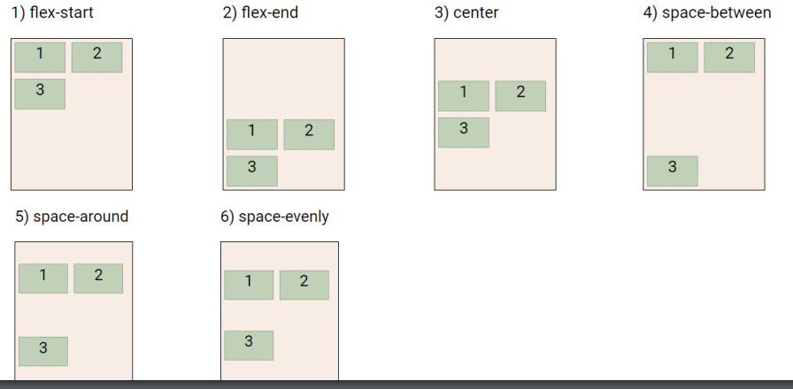
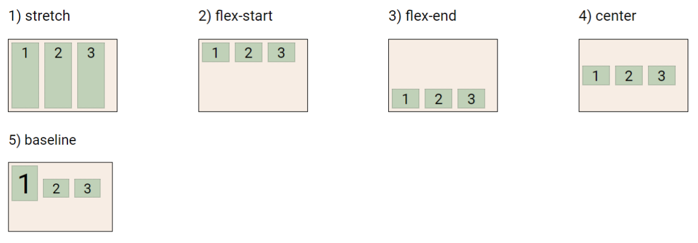
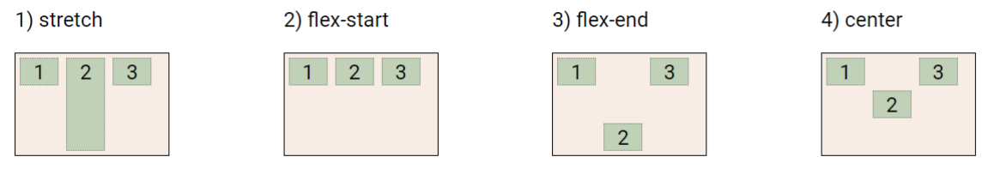

### 💻CSS Position

문서상에서 요소의 위치를 지정

- `static`: 모든 태그의 기본 값(기준 위치)

  - 일반적인 요소의 배치 순서(좌측 상단 => 우측 하단)

  - 부모 요소 내에서 배치될 때는 부모 요소의 위치를 기준으로 배치 됨

  - 아래의 좌표 프로퍼티를 이용하여 이동 가능

#### 1. relative: 상대 위치

- 자기 자신의 static 위치를 기준으로 이동

- 레이아웃에서 요소가 차지하는 공간은 static일 때와 같다

#### 2. absolute: 절대 위치

- static이 아닌 가장 가까운 부모 요소 기준으로 위치 이동 (없는 경우 브라우저 기준으로 이동)

#### 3. fixed: 고정 위치

- 부모 요소와 관계없이 viewport 기준으로 이동하고 그 위치에 고정된다.

- 페이지 스크롤 시에도 이동하지 않는다.

#### 4. sticky: 스크롤에 따라서 static > fixed로 바뀜

- 평소에는 문서 내에서 static과 같이 일반적인 흐름에 따르지만 스크롤 위치가 임계점에 이르면 fixed와 같이 박스를 화면에 고정 가능

- 일반적으로 Navigation bar에서 사용된다.

직접 차이를 확인해보자.

```html
<html>
  <head>
    <style>
      /* 모든 div 태그에 적용 (static)*/
      body {
        height: 10000px;
      }
      div {
        height: 100px;
        width: 100px;
        background-color: #9775fa;
        color: black;
        line-height: 100px;
        text-align: center;
      }
      /* static 기준으로 위치 변경 (절대 겹치지 않음)*/
      .relative {
        position: relative;
        text-align: left;
        line-height: 30px;
        top: 100px;
        left: 100px;
      }
      /* 부모 요소인 relative기준으로 absolute 위치 변경 (겹칠 수도 있음)*/
      .absolute {
        position: absolute;
        top: 50px;
        left: 50px;
      }
      /* 부모 요소와 관계없고 스크롤의 위치와 관계없이 무조건 그 자리에 고정 */
      .fixed {
        position: fixed;
        top: 8px;
        right: 8px;
      }
    </style>
  </head>
  <body>
    <div>
      static
      <div class="relative">
        relative
        <div class="absolute">absolute</div>
        <div class="fixed">fixed</div>
      </div>
    </div>
  </body>
</html>
```


<br>

absolute vs relative 차이를 직접 확인해보자.

```html
<html>
  <head>
    <style>
      div {
        box-sizing: border-box;
        width: 100px;
        height: 100px;
        border: 1px solid black;
      }
      .parent {
        position: relative;
        width: 300px;
        height: 300px;
      }
      .absolute {
        position: absolute;
        top: 100px;
        left: 100px;
        background-color: crimson;
      }
      .sibling {
        background-color: deepskyblue;
      }
      .relative {
        position: relative;
        top: 100px;
        left: 100px;
        background-color: crimson;
      }
    </style>
  </head>
  <body>
    <div class="parent">
      <div class="absolute">형_absolute</div>
      <div class="sibling">동생</div>
    </div>
    <div class="parent">
      <div class="relative">형_relative</div>
      <div class="sibling">동생</div>
    </div>
  </body>
</html>
```

🌟absolute의 경우 형\_absolute의 실제 위치가 변경되었다. 즉 다음 요소가 형\_absolute의 왼쪽에 오게 된다.

🌟relative의 경우 실제 위치는 그대로이고, 박스가 사람 눈에만 이동한 것처럼 보인다. 따라서 다음 요소가 동생의 아래에 오게 된다.


🍯웹페이지에서 부모를 기준을 특정 위치에 요소를 위치시키고 싶으면 absolute를,

🍯브라우저를 기준으로 특정 위치에 계속 위치시키고 싶으면 fixed를 사용하자.

<br>

### 💻CSS 원칙

1. CSS 원칙 I, II

   - 모든 요소는 네모(박스모델), 좌측상단에 배치

   - display에 따라 크기와 배치가 달라짐

2. CSS 원칙 III

   - position으로 위치의 기준을 변경

   - relative: 본인의 원래 위치

   - absolute: 특정 부모의 위치

   - fixed: 화면의 위치

   - sticky: 기본적으로 static이나 스크롤 이동에 따라 fixed로 변경

<br>

### 💻CSS Layout 종류 몇가지

- Display

- Position

- Float

- Flexbox

- Grid

<br>

### 💻Float

박스를 왼쪽 혹은 오른쪽으로 이동시켜 텍스트를 포함 인라인요소들이 주변을 wrapping 하도록 함

요소가 Normal flow를 벗어나도록 함

```html

```

<br>

### 💻Flexbox

행과 열의 형태로 아이템들을 배치하는 1차원 레이아웃 모델

- 축:

  - main axis (메인 축)

  - cross axis(교차 축)

- 구성 요소:

  - Flex Container (부모 요소)

  - Flex Item (자식 요소)


<br>

### 💻Flexbox 구성 요소

- Flex Container (부모 요소)

  - flexbox 레이아웃을 형성하는 가장 기본적인 모델

  - Flex Item들이 놓여있는 영역

  - `display` 속성을 `flex` 혹은 `inline-flex`로 지정

<br>

### 💻Flex 속성

- 배치 설정

  - `flex-direction`

  - `flex-wrap`

- 공간 나누기

  - `justify-content` (main axis)

  - `align-content` (cross axis)

- 정렬

  - `align-items`(모든 아이템을 cross axis 기준으로 정렬)

  - `align-self`(개별 아이템)

<br>

### 💻Flex 속성: flex-direction

- Main axis 기준 방향 설정

- 역방향의 경우 HTML 태그 선언 순서와 시각적으로 다르니 유의할 것

#### 🌟방향

1. row (▶️)

2. row-reverse(◀️)

3. column(🔽)

4. column-reverse(🔼)

<br>

### 💻Flex 속성: flex-wrap

- 아이템이 컨테이너 영역을 벗어나지 못하도록 함

1. `nowrap`(기본 값): 한줄로 배치

2. `wrap`: 넘치면 그 다음 줄로 배치


<br>

### 💻Flex 속성: flex-flow

- `flex-direction` 과 `flex-wrap` 에 대한 값을 차례로 작성

- 한번에 값을 작성할 수 있다

```css
div {
  flex-flow: row nowrap;
}
```

### 💻Flex 속성: justify-content

- Main axis를 기준으로 공간 배분(가로줄)

1. flex-start

2. flex-end

3. center

4. space-between

5. space-around

6. space-evenly


<br>

### 💻Flex 속성: align-content

- Cross axis를 기준을 공간 배분(세로줄)

1. flex-start

2. flex-end

3. center

4. space-between

5. space-around

6. space-evenly



<br>

### 💻Flex 속성: justify content & align-content

속성 값들

- `flex-start`: 아이템을 axis의 시작점으로

- `flex-end`: 아이템을 axis의 끝점으로

- `center`: 아이템을 axis의 중앙으로

- `space-between`: 아이템 사이의 간격을 균일하게 분배

- `space-around`: 아이템을 둘러싼 영역을 균일하게 분배

- `space-evenly`: 아이템간 간격을 균일하게 분배

<br>

### 💻Flex 속성: align-items

- 모든 아이템을 Cross axis 기준으로 정렬

1. stretch

2. flex-start

3. flex-end

4. center

5. baseline



<br>

### 💻Flex 속성: align-self

- 개별 아이템을 Cross axis 기준으로 정렬

1. stretch

2. flex start

3. flex-end

4. center

🌟아래의 사진은 2번 아이템에 `align-self`를 적용한 것



<br>

### 💻Flex 속성: align-items & align-self

속성 값들

- `stretch`: 컨테이너 가득 채우기

- `flex-start`: 위

- `flex-end`: 아래

- `counter`: 가운데

- `baseline`: 텍스트 baseline에 기준선을 맞춤

<br>

### 💻Flex 기타 속성

- `flow-grow`: 남은 영역을 아이템에 분배

- `order`: 순서 배치

<br>

## Reference

[이번에야말로 CSS Flex를 익혀보자](https://studiomeal.com/archives/197)
