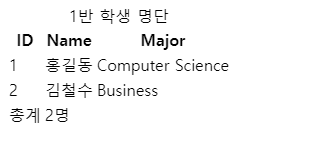

### 💻Table 태그

테이블의 영역을 명시하기 위해 활용한다.

필수 요소는 아니다.

#### 🌟테이블에서의 전체적인 큰 틀

- `<thead>`: header 역할 태그

- `<tbody>`: body 역할 태그

- `<tfoot>`: footer 역할 태그

#### 🌟테이블 세부 구성

- `<tr>`(table row): 행 구성 태그

- `<th>`(table head): 셀 구성 태그

- `<td>`(table data): 셀 구성 태그

`colspan`, `rowspan`: 셀 병합 속성

`caption`: 표 설명 또는 제목

#### 🌟테이블 태그 구성

- thead

  -tr > th

- tbody

  - tr > td

- tfoot

  - tr > td

```html
<body>
  <table>
    <thead>
      <tr>
        <th>ID</th>
        <th>Name</th>
        <th>Major</th>
      </tr>
    </thead>
    <tbody>
      <tr>
        <td>1</td>
        <td>홍길동</td>
        <td>Computer Science</td>
      </tr>
      <tr>
        <td>2</td>
        <td>김철수</td>
        <td>Business</td>
      </tr>
    </tbody>
    <tfoot>
      <tr>
        <td>총계</td>
        <td colspan="2">2명</td>
      </tr>
    </tfoot>
    <caption>
      1반 학생 명단
    </caption>
  </table>
</body>
```



<br>

### 💻Form 태그

`<form>` : 데이터(정보)를 서버에 제출하기 위해 사용하는 태그

#### 🌟`<form>`의 기본 속성

- `<form action="/search">`: form을 처리할 서버의 URL(데이터를 보낼 곳)

- `<form method="">`: form을 제출할 때 사용할 HTTP 메서드 (GET 혹은 POST)

- `<form enctype="">`: method가 post인 경우 데이터의 유형

```html
<form action="/search" method="GET"></form>
```

<br>

### 💻Input 태그

- `<input>`: 입력을 위한 태그. 다양한 타입을 지니는 입력 데이터 유형과 위젯이 제공

  - `<input type="">`: input 태그의 action 값에는 여러가지 type값이 존재한다.

  - `<input name="">`: form control에 적용되는 이름(이름/값 페어로 전송됨)

  - `<input value="">`: form control에 적용되는 값(이름/값 페어로 전송됨)

  그 밖에 required, readonly, autofocus, autocomplete, disabled 등 여러가지 속성이 존재한다. 나중에 찾아보도록 하자

```html
<!-- https://www.google.com/search?q=검색어 와 같다. -->
<form action="/search" method="GET">
  <input type="text" name="q" />
</form>
```

- `input label`

- `input checkbox`

- `input radio`:

  - name 속성을 동일하게 해 줘야 radio가 정상적으로 작동된다.

  - value를 입력해줘야한다.

  - value(값)이 name(이름)으로 매핑되어서 서버로 전송된다.

그 외

- color

- date

- hidden

<br>

### 💻Bootstrap

반응형 웹 개발을 조금 더 빠르게 할 수 있게 돕는 도구

세계에서 가장 유명한 프론트엔드 오픈소스들 중 하나이다.

bootstrap은 클래스명에 속성이 미리 저장되어 있다. 따라서 속성이 지정된 클래스명만 적어줘도 자동으로 CSS가 적용된다. CSS처럼 따로 클래스에 속성을 따로 정의해주지 않아도 된다.

#### 🍯Bootstrap 기본형

class에 속성명을 주어서 속성값을 준다.

```html
<div class="bootstrap attribute"></div>
```

<br>

#### 🌟Bootstrap 문서를 보면서 사용법을 익혀보자.

[Bootstrap 공식문서](https://getbootstrap.kr/docs/5.1/getting-started/introduction/)

<br>

### 💻Content Delivery(Distribution) Network

### 💻spacing

`class="{property}{sides}-{size}"`

`class="mt-3"`: margin top

`class="ms-5"`: margin side

- sides:

  - t

  - b

  - s

- size:

  - 3 => 기준, 1rem(16px)

`class="mx-auto"`: "블록 요소"를 수평 중앙 정렬, 가로 가운데 정렬시 사용

`class="py-0"`: padding top bottom 0

<br>

### 💻Color

### 💻Display

### 💻Position

`<div class="position-absolute top-0 start-0"></div>`
